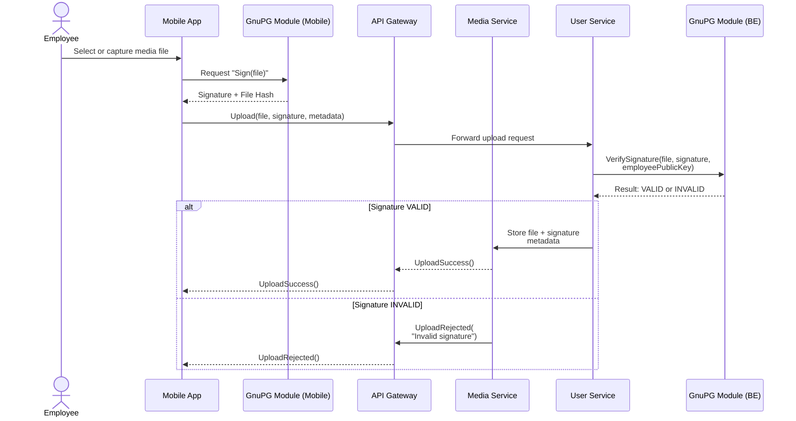
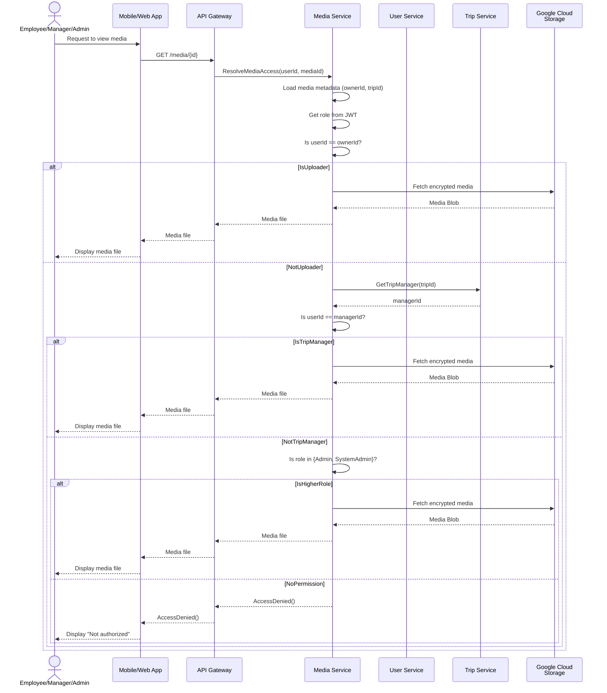

# GnuPG Use Cases

---

## Media Digital Signature

**Sequence diagram of Media signature use case**

```mermaid
sequenceDiagram
    actor Employee as Employee
    participant App as Mobile App
    participant GPG as GnuPG Module (Mobile)
    participant Gateway as API Gateway
    participant MediaSvc as Media Service
    participant UserSvc as User Service
    participant GPG_Mo as GnuPG Module (BE)

    Employee ->> App: Select or capture media file
    App ->> GPG: Request "Sign(file)"
    GPG -->> App: Signature + File Hash

    App ->> Gateway: Upload(file, signature, metadata)
    Gateway ->> UserSvc: Forward upload request

    UserSvc ->> GPG_Mo: VerifySignature(file, signature, <br/>employeePublicKey)
    GPG_Mo -->> UserSvc: Result: VALID or INVALID

    alt Signature VALID
        UserSvc ->> MediaSvc: Store file + signature <br/>metadata
        MediaSvc -->> Gateway: UploadSuccess()
        Gateway -->> App: UploadSuccess()
    else Signature INVALID
        MediaSvc ->> Gateway: UploadRejected(<br/>"Invalid signature")
        Gateway -->> App: UploadRejected()
    end
```

---

## Authorized Media Viewer

**Sequence diagram for authorized media viewer use case**

```mermaid
sequenceDiagram
    actor User as Employee/Manager/Admin
    participant App as Mobile/Web App
    participant Gateway as API Gateway
    participant MediaSvc as Media Service
    participant UserSvc as User Service
    participant TripSvc as Trip Service
    participant Storage as Google Cloud<br/>Storage

    User ->> App: Request to view media
    App ->> Gateway: GET /media/{id}

    %% Gateway forwards request with authenticated userId
    Gateway ->> MediaSvc: ResolveMediaAccess(userId, mediaId)

    %% Media Service loads media metadata
    MediaSvc ->> MediaSvc: Load media metadata (ownerId, tripId)

    %% Fetch user role
    MediaSvc ->> MediaSvc: Get role from JWT

    %% Check if user is uploader
    MediaSvc ->> MediaSvc: Is userId == ownerId?

    alt IsUploader
        MediaSvc ->> Storage: Fetch encrypted media
        Storage -->> MediaSvc: Media Blob
        MediaSvc -->> Gateway: Media file
        Gateway -->> App: Media file
        App -->> User: Display media file
    else NotUploader
        %% Next: Check if user is Trip Manager
        MediaSvc ->> TripSvc: GetTripManager(tripId)
        TripSvc -->> MediaSvc: managerId

        MediaSvc ->> MediaSvc: Is userId == managerId?

        alt IsTripManager
            MediaSvc ->> Storage: Fetch encrypted media
            Storage -->> MediaSvc: Media Blob
            MediaSvc -->> Gateway: Media file
            Gateway -->> App: Media file
            App -->> User: Display media file
        else NotTripManager
            %% Next: Check elevated privileges (Admin, SystemAdmin)
            MediaSvc ->> MediaSvc: Is role in {Admin, SystemAdmin}?

            alt IsHigherRole
                MediaSvc ->> Storage: Fetch encrypted media
                Storage -->> MediaSvc: Media Blob
                MediaSvc -->> Gateway: Media file
                Gateway -->> App: Media file
                App -->> User: Display media file
            else NoPermission
                MediaSvc -->> Gateway: AccessDenied()
                Gateway -->> App: AccessDenied()
                App -->> User: Display "Not authorized"
            end
        end
    end
```
