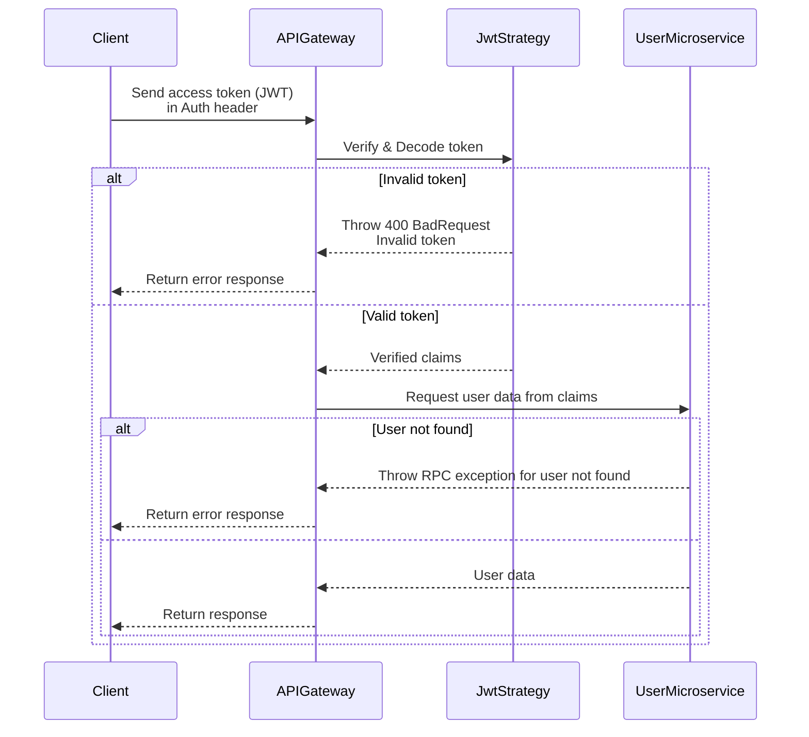

# TripSync Microservices Authentication & Authorization Flow

---

> *This document explains the authentication and authorization flow of the microservices system.*

---

<!-- @import "[TOC]" {cmd="toc" depthFrom=1 depthTo=6 orderedList=false} -->

<!-- code_chunk_output -->

- [TripSync Microservices Authentication & Authorization Flow](#tripsync-microservices-authentication--authorization-flow)
  - [Goals](#goals)
  - [Idea](#idea)
  - [Diagram](#diagram)
    - [JWT Authentication Flow In Trip Sync Microservices System](#jwt-authentication-flow-in-trip-sync-microservices-system)

<!-- /code_chunk_output -->

---

## Goals

1. Authenticate users by email, password, and JWT authtentication strategy.
2. Authorization base on the system's roles and permissions.
3. Optimize for less service communication.

---

## Idea

Most of the time, the users will be authenticated by the system using their access token via JWT auth strategy. Normally, the `auth` service will handle this task, but this will increased the stress and load on the `auth` service.

To resolve this problem, JWT auth process will be placed on the `API gateway` instead.More specific, the gateway will verify, and decode the token first. Then validate the token if it's expired or user of that token is logged out of the syste or not. This way the `API gateway` can send user's credentials to each microservices in the system.

---

## Diagram

### JWT Authentication Flow In Trip Sync Microservices System

