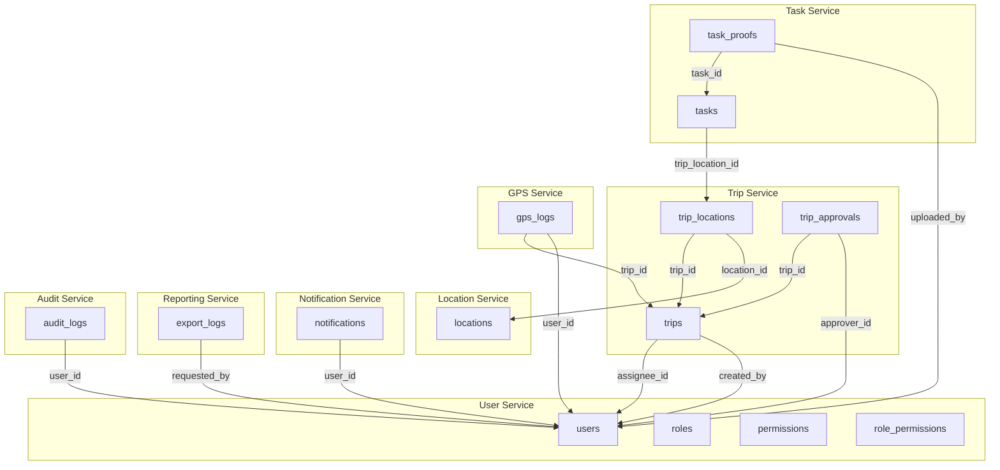

# Microservices System Design for Trip Sync

---

<!-- @import "[TOC]" {cmd="toc" depthFrom=2 depthTo=6 orderedList=false} -->

<!-- code_chunk_output -->

- [Necessary Dependencies For Services](#necessary-dependencies-for-services)
- [1. Domain Analysis & Service Boundaries](#1-domain-analysis--service-boundaries)
  - [A. User & Identity Service](#a-user--identity-service)
  - [B. Trip Management Service](#b-trip-management-service)
  - [C. Task & Proof Service](#c-task--proof-service)
  - [D. Location Service](#d-location-service)
  - [E. GPS Tracking Service](#e-gps-tracking-service)
  - [F. Notification Service](#f-notification-service)
  - [G. Reporting & Export Service](#g-reporting--export-service)
  - [H. Audit Logging Service](#h-audit-logging-service)
- [2. Service-to-Table Mapping](#2-service-to-table-mapping)
- [3. Database Splitting](#3-database-splitting)
- [4. Service Interactions (High-level)](#4-service-interactions-high-level)
- [5. Summary Table](#5-summary-table)
- [6. API Gateway Endpoints and Service Subscribers](#6-api-gateway-endpoints-and-service-subscribers)
    - [**Auth Endpoints** (`/auth`)](#auth-endpoints-auth)
    - [**User Endpoints** (`/users`)](#user-endpoints-users)
    - [**Role Endpoints** (`/roles`)](#role-endpoints-roles)
    - [**Permission Endpoints** (`/permissions`)](#permission-endpoints-permissions)
    - [**Trip Service** (`/trips`)](#trip-service-trips)
    - [**Task & Proof Service** (`/tasks`, `/proofs`)](#task--proof-service-tasks-proofs)
    - [**Location Service** (`/locations`)](#location-service-locations)
    - [**GPS Tracking Service** (`/gps-logs`)](#gps-tracking-service-gps-logs)
    - [**Notification Service** (`/notifications`)](#notification-service-notifications)
    - [**Reporting & Export Service** (`/reports`, `/exports`)](#reporting--export-service-reports-exports)
    - [**Audit Logging Service** (`/audit-logs`)](#audit-logging-service-audit-logs)
- [7. Authorization](#7-authorization)
  - [Role-Based Permission Matrix](#role-based-permission-matrix)

<!-- /code_chunk_output -->


---

## Necessary Dependencies For Services

**Important:** Use the below command to install necessary dependencies.

```bash
npm install @nestjs/microservices@10 @nestjs/config @nestjs/typeorm class-transformer class-validator joi mysql2 nats reflect-metadata typeorm
```

---

## 1. Domain Analysis & Service Boundaries

Based on the requirements and the original monolithic schema, the system is split into the following main microservices:

### A. User & Identity Service
- **Responsibilities:** User management, authentication, authorization, roles, permissions.
- **Tables:** `users`, `roles`, `permissions`, `role_permissions`
- **Database:** User DB

### B. Trip Management Service
- **Responsibilities:** Trip creation, assignment, scheduling, trip status, trip locations, approvals.
- **Tables:** `trips`, `trip_locations`, `trip_approvals`
- **Database:** Trip DB

### C. Task & Proof Service
- **Responsibilities:** Tasks for each trip location, task status, proof uploads (photos, videos), proof metadata.
- **Tables:** `tasks`, `task_proofs`
- **Database:** Task DB

### D. Location Service
- **Responsibilities:** Manage locations, geospatial data, location search.
- **Tables:** `locations`
- **Database:** Location DB

### E. GPS Tracking Service
- **Responsibilities:** Real-time GPS logging, route tracking.
- **Tables:** `gps_logs`
- **Database:** GPS DB

### F. Notification Service
- **Responsibilities:** Sending and tracking notifications to users.
- **Tables:** `notifications`
- **Database:** Notification DB

### G. Reporting & Export Service
- **Responsibilities:** Data export, report generation, export logs.
- **Tables:** `export_logs`
- **Database:** Reporting DB

### H. Audit Logging Service
- **Responsibilities:** System-wide audit logs for actions.
- **Tables:** `audit_logs`
- **Database:** Audit DB

---

## 2. Service-to-Table Mapping

| Service            | Tables                                      |
|--------------------|---------------------------------------------|
| User & Identity    | users, roles, permissions, role_permissions |
| Trip Management    | trips, trip_locations, trip_approvals       |
| Task & Proof       | tasks, task_proofs                          |
| Location           | locations                                   |
| GPS Tracking       | gps_logs                                    |
| Notification       | notifications                               |
| Reporting & Export | export_logs                                 |
| Audit Logging      | audit_logs                                  |

---

## 3. Database Splitting

Each service has its own database. **No direct cross-database foreign keys**—use IDs and service APIs for cross-service references.

- **User DB:** `users`, `roles`, `permissions`, `role_permissions`
- **Trip DB:** `trips`, `trip_locations`, `trip_approvals`
- **Task DB:** `tasks`, `task_proofs`
- **Location DB:** `locations`
- **GPS DB:** `gps_logs`
- **Notification DB:** `notifications`
- **Reporting DB:** `export_logs`
- **Audit DB:** `audit_logs`

**Example:**  
- `trips.assignee_id` is a user ID, but in microservices, Trip Service only stores the ID; to get user info, it calls User Service API.

---

## 4. Service Interactions (High-level)



---

## 5. Summary Table

| Service Name         | Main Responsibility          | Owns Tables                           | Owns DB? | Exposes API? | Calls Other APIs? |
|----------------------|------------------------------|---------------------------------------|----------|--------------|-------------------|
| User Service         | Auth, user, role, permission | users, roles, permissions             | Yes      | Yes          | No                |
| Trip Service         | Trip lifecycle, assignment   | trips, trip_locations, trip_approvals | Yes      | Yes          | User, Location    |
| Task Service         | Tasks, proofs                | tasks, task_proofs                    | Yes      | Yes          | Trip, User        |
| Location Service     | Location CRUD, geodata       | locations                             | Yes      | Yes          | No                |
| GPS Service          | GPS logs, tracking           | gps_logs                              | Yes      | Yes          | Trip, User        |
| Notification Service | Notifications                | notifications                         | Yes      | Yes          | User              |
| Reporting Service    | Data export, reporting       | export_logs                           | Yes      | Yes          | User, Trip, Task  |
| Audit Service        | Audit logs                   | audit_logs                            | Yes      | Yes          | User, All         |

---

## 6. API Gateway Endpoints and Service Subscribers

#### **Auth Endpoints** (`/auth`)
| Endpoint               | Method | Description      | Subscriber (Service)        | Message Pattern             |
|------------------------|--------|------------------|-----------------------------|-----------------------------|
| /auth/login            | POST   | User login       | user-micro (AuthController) | auth.login                  |
| /auth/logout           | POST   | User logout      | user-micro (AuthController) | auth.logout (assumed)       |
| /auth/tokens/exchange  | POST   | Exchange tokens  | user-micro (AuthController) | (not shown, likely similar) |
| /auth/authorize-claims | POST   | Authorize claims | user-micro (AuthController) | auth.authorize_claims       |

#### **User Endpoints** (`/users`)
| Endpoint  | Method | Description      | Subscriber (Service)        | Message Pattern |
|-----------|--------|------------------|-----------------------------|-----------------|
| /users/me | GET    | Get current user | user-micro (UserController) | user.find.id    |
| /users    | GET    | Find users       | user-micro (UserController) | user.find       |
| /users    | POST   | Create user      | user-micro (UserController) | user.create     |
| /users    | PATCH  | Update user      | user-micro (UserController) | user.update     |

#### **Role Endpoints** (`/roles`)
| Endpoint   | Method | Description    | Subscriber (Service)        | Message Pattern |
|------------|--------|----------------|-----------------------------|-----------------|
| /roles     | POST   | Create role    | user-micro (RoleController) | role.create     |
| /roles     | GET    | Get all roles  | user-micro (RoleController) | role.find_all   |
| /roles/:id | GET    | Get role by ID | user-micro (RoleController) | role.find_one   |
| /roles/:id | PATCH  | Update role    | user-micro (RoleController) | role.update     |
| /roles/:id | DELETE | Delete role    | user-micro (RoleController) | role.remove     |

#### **Permission Endpoints** (`/permissions`)
| Endpoint          | Method | Description             | Subscriber (Service)              | Message Pattern                 |
|-------------------|--------|-------------------------|-----------------------------------|---------------------------------|
| /permissions      | POST   | Create permission       | user-micro (PermissionController) | permission.create (likely)      |
| /permissions/bulk | POST   | Bulk create permissions | user-micro (PermissionController) | permission.bulk_create (likely) |
| /permissions      | GET    | Get all permissions     | user-micro (PermissionController) | permission.find_all (likely)    |
| /permissions/:id  | GET    | Get permission by ID    | user-micro (PermissionController) | permission.find_one (likely)    |
| /permissions/:id  | PUT    | Update permission       | user-micro (PermissionController) | permission.update (likely)      |
| /permissions/:id  | DELETE | Delete permission       | user-micro (PermissionController) | permission.remove (likely)      |

#### **Trip Service** (`/trips`)
| Endpoint             | Method | Description         | Subscriber (Service) | NATS Message Pattern |
|----------------------|--------|---------------------|----------------------|----------------------|
| /trips               | GET    | List/filter trips   | trip-micro           | trip.find            |
| /trips               | POST   | Create a new trip   | trip-micro           | trip.create          |
| /trips/:id           | GET    | Get trip details    | trip-micro           | trip.find_one        |
| /trips/:id           | PATCH  | Update trip         | trip-micro           | trip.update          |
| /trips/:id           | DELETE | Delete/cancel trip  | trip-micro           | trip.delete          |
| /trips/:id/approve   | POST   | Approve trip        | trip-micro           | trip.approve         |
| /trips/:id/locations | GET    | List trip locations | trip-micro           | trip.locations       |
| /trips/:id/approvals | GET    | List trip approvals | trip-micro           | trip.approvals       |

#### **Task & Proof Service** (`/tasks`, `/proofs`)
| Endpoint          | Method | Description            | Subscriber (Service) | NATS Message Pattern |
|-------------------|--------|------------------------|----------------------|----------------------|
| /tasks            | GET    | List/filter tasks      | task-micro           | task.find            |
| /tasks            | POST   | Create a new task      | task-micro           | task.create          |
| /tasks/:id        | GET    | Get task details       | task-micro           | task.find_one        |
| /tasks/:id        | PATCH  | Update task            | task-micro           | task.update          |
| /tasks/:id        | DELETE | Delete/cancel task     | task-micro           | task.delete          |
| /tasks/:id/proofs | GET    | List proofs for a task | task-micro           | proof.find_by_task   |
| /tasks/:id/proofs | POST   | Add proof to a task    | task-micro           | proof.create         |
| /proofs/:id       | GET    | Get proof details      | task-micro           | proof.find_one       |
| /proofs/:id       | DELETE | Delete proof           | task-micro           | proof.delete         |

#### **Location Service** (`/locations`)
| Endpoint       | Method | Description           | Subscriber (Service) | NATS Message Pattern |
|----------------|--------|-----------------------|----------------------|----------------------|
| /locations     | GET    | List/filter locations | location-micro       | location.find        |
| /locations     | POST   | Create a new location | location-micro       | location.create      |
| /locations/:id | GET    | Get location details  | location-micro       | location.find_one    |
| /locations/:id | PATCH  | Update location       | location-micro       | location.update      |
| /locations/:id | DELETE | Delete location       | location-micro       | location.delete      |

#### **GPS Tracking Service** (`/gps-logs`)
| Endpoint      | Method | Description          | Subscriber (Service) | NATS Message Pattern |
|---------------|--------|----------------------|----------------------|----------------------|
| /gps-logs     | GET    | List/filter GPS logs | gps-micro            | gps.find             |
| /gps-logs     | POST   | Add a GPS log        | gps-micro            | gps.create           |
| /gps-logs/:id | GET    | Get GPS log details  | gps-micro            | gps.find_one         |
| /gps-logs/:id | DELETE | Delete GPS log       | gps-micro            | gps.delete           |

#### **Notification Service** (`/notifications`)
| Endpoint           | Method | Description               | Subscriber (Service) | NATS Message Pattern   |
|--------------------|--------|---------------------------|----------------------|------------------------|
| /notifications     | GET    | List/filter notifications | notification-micro   | notification.find      |
| /notifications     | POST   | Create/send notification  | notification-micro   | notification.create    |
| /notifications/:id | PATCH  | Mark as read              | notification-micro   | notification.mark_read |
| /notifications/:id | DELETE | Delete notification       | notification-micro   | notification.delete    |

#### **Reporting & Export Service** (`/reports`, `/exports`)
| Endpoint       | Method | Description                | Subscriber (Service) | NATS Message Pattern   |
|----------------|--------|----------------------------|----------------------|------------------------|
| /reports/trips | GET    | Export trip summary        | report-micro         | report.trip_summary    |
| /reports/tasks | GET    | Export task completion     | report-micro         | report.task_completion |
| /exports       | POST   | Request export (CSV/Excel) | report-micro         | export.create          |
| /exports/:id   | GET    | Get export file/status     | report-micro         | export.find_one        |

#### **Audit Logging Service** (`/audit-logs`)
| Endpoint        | Method | Description            | Subscriber (Service) | NATS Message Pattern |
|-----------------|--------|------------------------|----------------------|----------------------|
| /audit-logs     | GET    | List/filter audit logs | audit-log-micro      | audit.find           |
| /audit-logs/:id | GET    | Get audit log details  | audit-log-micro      | audit.find_one       |

---

**Note:**
- The above planned endpoints and message patterns are based on best practices and your requirements. Actual implementation may require adjustments to fit business logic and security needs.
- Each microservice should implement the corresponding NATS message pattern handler for its domain.
- The API Gateway will route HTTP requests to the correct service via NATS message patterns.

---

## 7. Authorization

Roles: `system admin`, `manager`, and `employee`

Permissions:

- Actions: `create`, `read`, `update`, and `delete`
- Resources: `role`, `permission`, `user`, `trip`, `task`, `task proof`, `location`, `gps`, `notification`, `report`, and `log`

### Role-Based Permission Matrix

| Resource      | Action       | System Admin | Manager                        | Employee                       | Description/Notes                                                         |
|---------------|--------------|--------------|--------------------------------|--------------------------------|---------------------------------------------------------------------------|
| role          | CRUD         | ✓            | (read, create, update, delete) |                                | Only admin/manager can manage roles                                       |
| permission    | CRUD         | ✓            | (read)                         |                                | Only admin can manage permissions                                         |
| user          | CRUD         | ✓            | (read, create, update)         | (read, update own)             | Admin manages all, manager manages users, employee can update own profile |
| trip          | CRUD         | ✓            | ✓                              | (read, create own, update own) | Manager assigns, employee requests/updates own                            |
| trip approval | read, update | ✓            | ✓                              |                                | Manager/admin approve trips                                               |
| task          | CRUD         | ✓            | ✓                              | (read, update own)             | Manager assigns, employee updates/completes own                           |
| task proof    | CRUD         | ✓            | ✓                              | (create, read own)             | Employee submits proof, manager/admin reviews                             |
| location      | CRUD         | ✓            | ✓                              | (read)                         | Manager/admin manage, employee can view                                   |
| gps           | read         | ✓            | ✓                              | (create own, read own)         | Employee logs, manager/admin monitors                                     |
| notification  | CRUD         | ✓            | ✓                              | (read, update own)             | Employee receives, manager/admin sends                                    |
| report        | CRUD         | ✓            | ✓                              | (read own)                     | Manager/admin export, employee views own                                  |
| log (audit)   | read         | ✓            | (read)                         |                                | Only admin/manager can view logs                                          |

**Legend:**
- ✓ = Full access (create, read, update, delete)
- (action) = Only specific actions allowed
- "own" = Only for resources assigned to or created by the user

**Notes:**
- System Admin has full access to all resources and actions.
- Manager can manage users (except admin), assign trips/tasks, approve trips, manage locations, view logs, and export reports.
- Employee can view and update their own profile, request trips, update their own tasks, submit proofs, log GPS, and view their own notifications and reports.


