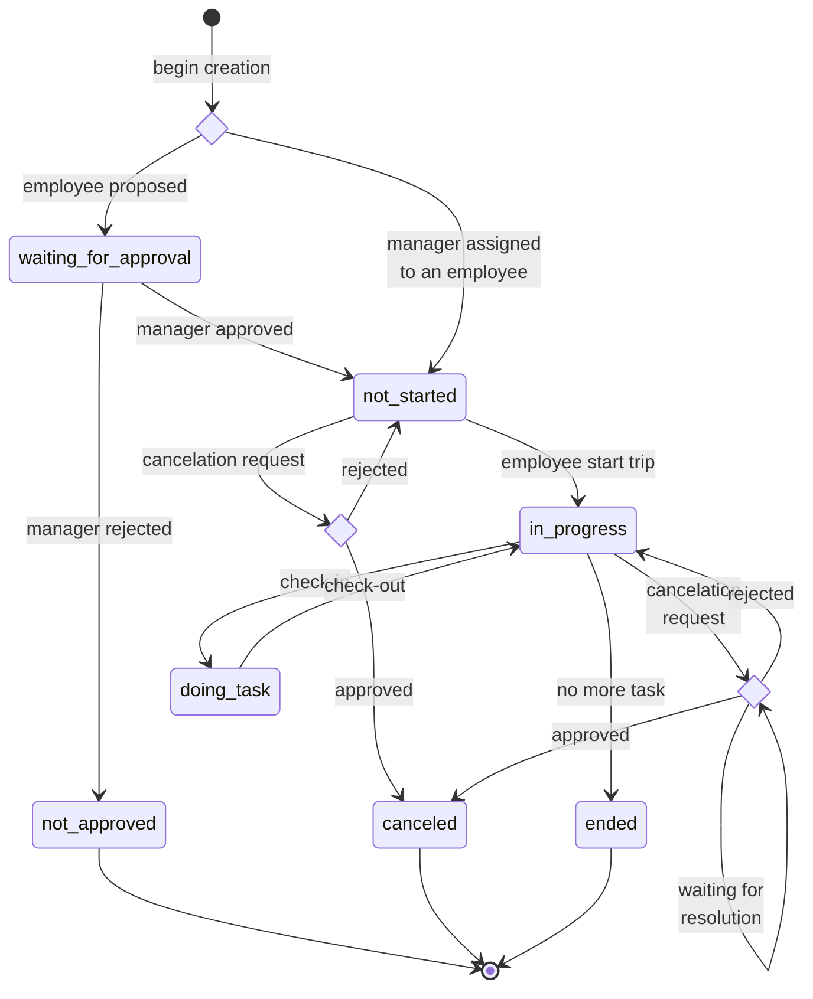
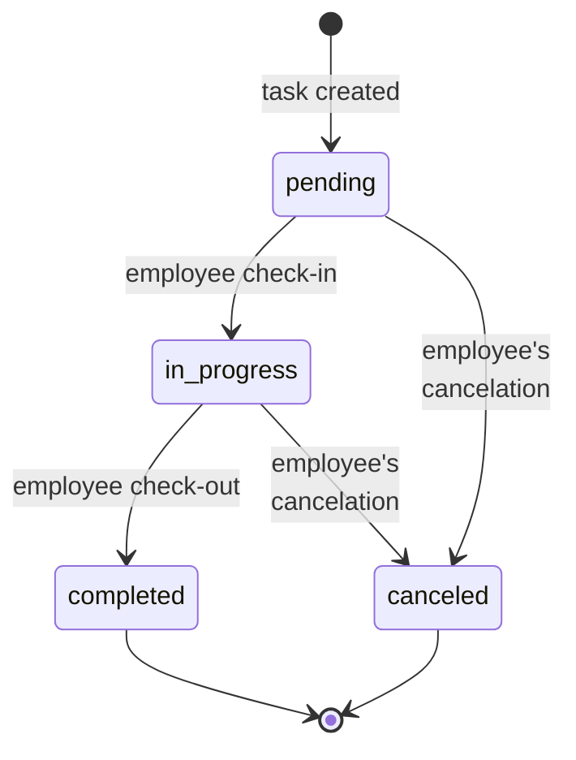
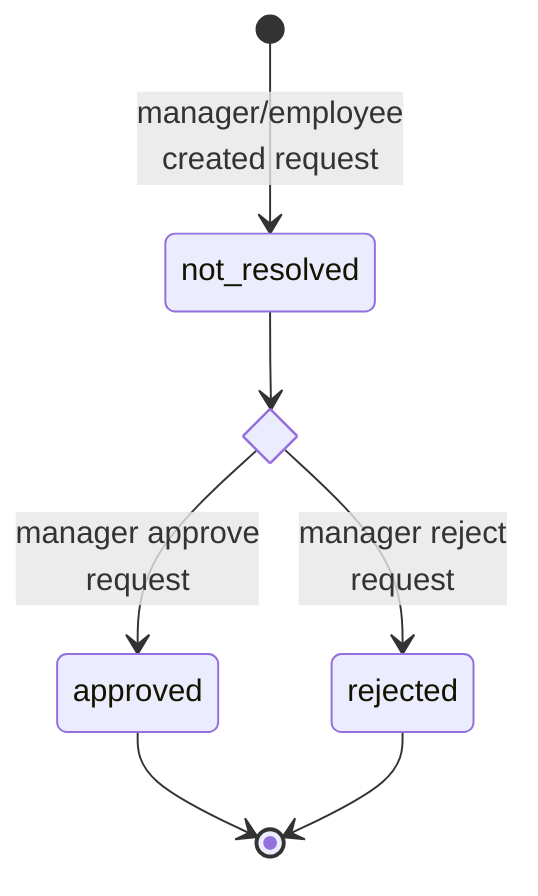

# State diagram

Trip status

```mermaid
stateDiagram-v2
    state if_state <<choice>>
    state if_state2 <<choice>>
    state if_state3 <<choice>>
    [*] --> if_state: begin creation
    if_state --> waiting_for_approval: employee proposed
    waiting_for_approval --> not_started: manager approved
    if_state --> not_started: manager assigned<br/>to an employee
    waiting_for_approval --> not_approved: manager rejected
    not_started --> in_progress: employee start trip
    not_started --> if_state2: cancelation request
    if_state2 --> not_started: rejected
    in_progress --> doing_task: check-in
    doing_task --> in_progress: check-out
    if_state2 --> canceled: approved
    in_progress --> if_state3: cancelation<br/>request
    if_state3 --> in_progress: rejected
    if_state3 --> canceled: approved
    if_state3 --> if_state3: waiting for<br/>resolution
    in_progress --> ended: no more task
    not_approved --> [*]
    canceled --> [*]
    ended --> [*]
```

Task state

```mermaid
stateDiagram-v2
    [*] --> pending: task created
    pending --> in_progress: employee check-in
    in_progress --> completed: employee check-out
    pending --> canceled: employee's<br/>cancelation
    in_progress --> canceled: employee's<br/>cancelation
    completed --> [*]
    canceled --> [*]
```

Cancelation

```mermaid
stateDiagram-v2
    state if_state <<choice>>
    [*] --> not_resolved: manager/employee<br/>created request
    not_resolved --> if_state
    if_state --> approved: manager approve<br/>request
    if_state --> rejected: manager reject<br/>request
    approved --> [*]
    rejected --> [*]
```

