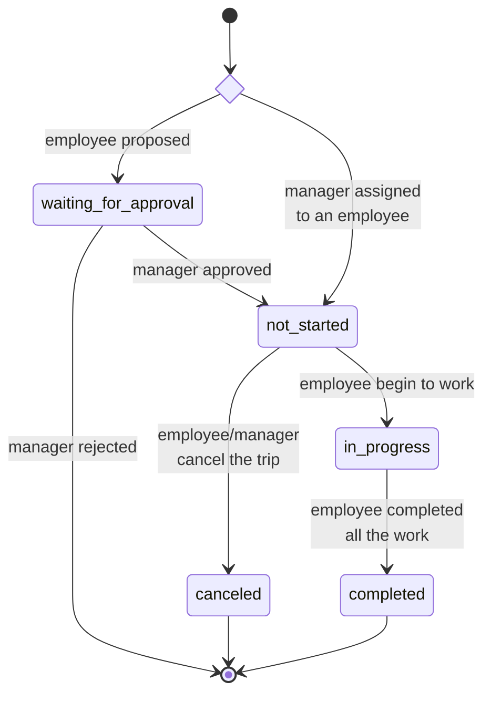
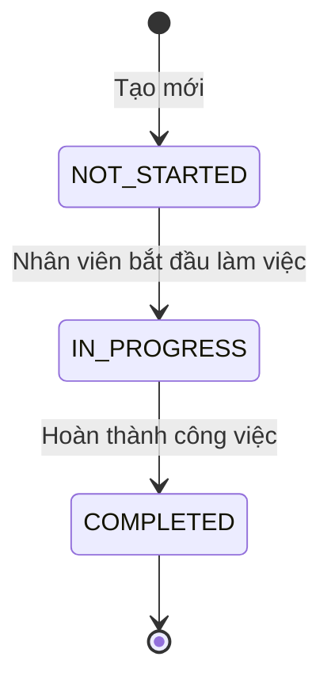

# State diagram

Trip status

Task state

0. (Trip đã tạo/đã được approved) Trạng thái lúc này là not_started
1. Bắt đầu trip -> PATCH /trips/{id} {status = 'in_progress'}
    - Hệ thống tự update progress
2. User check-in địa điểm X
    - Chụp/chọn minh chứng
    - Call API gửi minh chứng: POST /media (bỏ cái query param task-id đi, form data giữ nguyên)
    - Call API check-in-> PATCH /trips/locations/check-in { tripLocationId: 'xxx', latitude: x, longitude: y, timestamp: new Date(), attachmentId: 'xxx' } (Thêm field attachmentId để lưu minh chứng check-in)
3. User check-out địa điểm X
    - Chụp/chọn minh chứng
    - Call API gửi minh chứng: POST /media (bỏ cái query param task-id đi, form data giữ nguyên)
    - Call API check-out-> PATCH /trips/locations/check-out { tripLocationId: 'xxx', latitude: x, longitude: y, timestamp: new Date(), attachmentId: 'xxx' } (Thêm field attachmentId để lưu minh chứng check-in)
4. User hoàn thành công tác -> PATCH /trips/{id} {status = 'completed'}
5. Nếu employee cần hủy công tác đột xuất (các role khác đều dùng chung api này luôn)
    Call API -> PATCH /trips/{id} {status = 'canceled', attachmentId: 'xxx', note: 'Lí do cancel nằm đây'} (Thêm 2 field để lưu minh chứng + ghi chú)
