# Phân tích và Thiết kế Hệ Thống

---

<!-- @import "[TOC]" {cmd="toc" depthFrom=1 depthTo=6 orderedList=false} -->

<!-- code_chunk_output -->

- [Phân tích và Thiết kế Hệ Thống](#phân-tích-và-thiết-kế-hệ-thống)
  - [Phân tích hệ thống](#phân-tích-hệ-thống)
    - [Các tác nhân](#các-tác-nhân)
  - [Thiết kế hệ thống](#thiết-kế-hệ-thống)
    - [Kiến trúc tổng thể](#kiến-trúc-tổng-thể)
    - [Sơ đồ Use Case](#sơ-đồ-use-case)
    - [Ghi chú thiết kế cơ sở dữ liệu](#ghi-chú-thiết-kế-cơ-sở-dữ-liệu)
    - [Lưu ý bảo mật](#lưu-ý-bảo-mật)
    - [Tích hợp bên thứ ba](#tích-hợp-bên-thứ-ba)
  - [Sơ đồ tuần tự các use case chính](#sơ-đồ-tuần-tự-các-use-case-chính)
    - [1. Sơ đồ tuần tự: Gửi đề xuất công tác](#1-sơ-đồ-tuần-tự-gửi-đề-xuất-công-tác)
    - [2. Sơ đồ tuần tự: Chấm công (Check-in/Check-out) tại địa điểm công tác](#2-sơ-đồ-tuần-tự-chấm-công-check-incheck-out-tại-địa-điểm-công-tác)
    - [3. Sơ đồ tuần tự: Báo cáo nội dung công tác](#3-sơ-đồ-tuần-tự-báo-cáo-nội-dung-công-tác)
    - [4. Sơ đồ tuần tự: Nhận công tác hoặc thông báo](#4-sơ-đồ-tuần-tự-nhận-công-tác-hoặc-thông-báo)
    - [5. Sơ đồ tuần tự: Phân công công tác](#5-sơ-đồ-tuần-tự-phân-công-công-tác)
    - [6. Sơ đồ tuần tự: Phê duyệt đề xuất công tác](#6-sơ-đồ-tuần-tự-phê-duyệt-đề-xuất-công-tác)
    - [7. Sơ đồ tuần tự: Giám sát công tác của nhân viên](#7-sơ-đồ-tuần-tự-giám-sát-công-tác-của-nhân-viên)
    - [8. Sơ đồ tuần tự: Tổng hợp dữ liệu và xuất báo cáo công tác](#8-sơ-đồ-tuần-tự-tổng-hợp-dữ-liệu-và-xuất-báo-cáo-công-tác)
  - [Sơ đồ hoạt động chính của hệ thống](#sơ-đồ-hoạt-động-chính-của-hệ-thống)
    - [1. Gửi đề xuất công tác](#1-gửi-đề-xuất-công-tác)
    - [2. Chấm công (Check-in/Check-out)](#2-chấm-công-check-incheck-out)
    - [3. Báo cáo nội dung công tác](#3-báo-cáo-nội-dung-công-tác)
    - [4. Nhận công tác hoặc thông báo](#4-nhận-công-tác-hoặc-thông-báo)
    - [5. Phân công công tác](#5-phân-công-công-tác)
    - [6. Phê duyệt đề xuất công tác](#6-phê-duyệt-đề-xuất-công-tác)
    - [7. Giám sát công tác của nhân viên](#7-giám-sát-công-tác-của-nhân-viên)
    - [8. Tổng hợp dữ liệu và xuất báo cáo công tác](#8-tổng-hợp-dữ-liệu-và-xuất-báo-cáo-công-tác)
  - [Sơ đồ lớp hệ thống (Class Diagram)](#sơ-đồ-lớp-hệ-thống-class-diagram)
  - [Sơ đồ trạng thái chính của hệ thống](#sơ-đồ-trạng-thái-chính-của-hệ-thống)
    - [1. Sơ đồ trạng thái của Trip (Chuyến công tác)](#1-sơ-đồ-trạng-thái-của-trip-chuyến-công-tác)
    - [2. Sơ đồ trạng thái của Task (Nhiệm vụ)](#2-sơ-đồ-trạng-thái-của-task-nhiệm-vụ)
    - [3. Sơ đồ trạng thái của TripApproval (Phê duyệt công tác)](#3-sơ-đồ-trạng-thái-của-tripapproval-phê-duyệt-công-tác)
    - [4. Sơ đồ trạng thái của Notification (Thông báo)](#4-sơ-đồ-trạng-thái-của-notification-thông-báo)
    - [5. Sơ đồ trạng thái của Proof (Minh chứng)](#5-sơ-đồ-trạng-thái-của-proof-minh-chứng)

<!-- /code_chunk_output -->

---

## Phân tích hệ thống

### Các tác nhân

**Người dùng ứng dụng di động (Nhân viên):**

- Đăng ký và báo cáo chuyến công tác.
- Chấm công (Check-in/Check-out) bằng GPS.
- Tải lên minh chứng bằng ảnh/video.
- Nhận thông báo.
- Xem lịch sử công tác.

**Người dùng ứng dụng web (Quản lý):**

- Quản lý người dùng và phân quyền.
- Phân công và phê duyệt chuyến công tác.
- Giám sát vị trí và báo cáo của nhân viên.
- Xuất báo cáo tổng hợp.

---

##  Thiết kế hệ thống

### Kiến trúc tổng thể

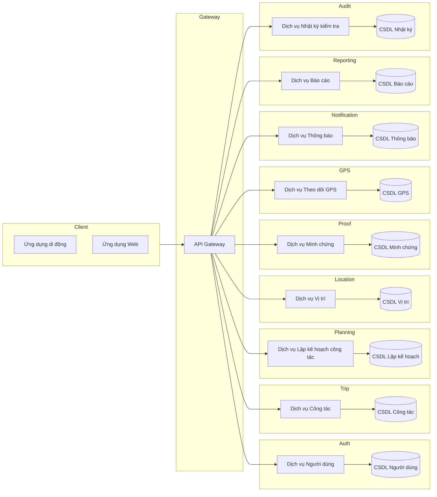

### Sơ đồ Use Case

**Use Case của Nhân viên (Ứng dụng di động)**

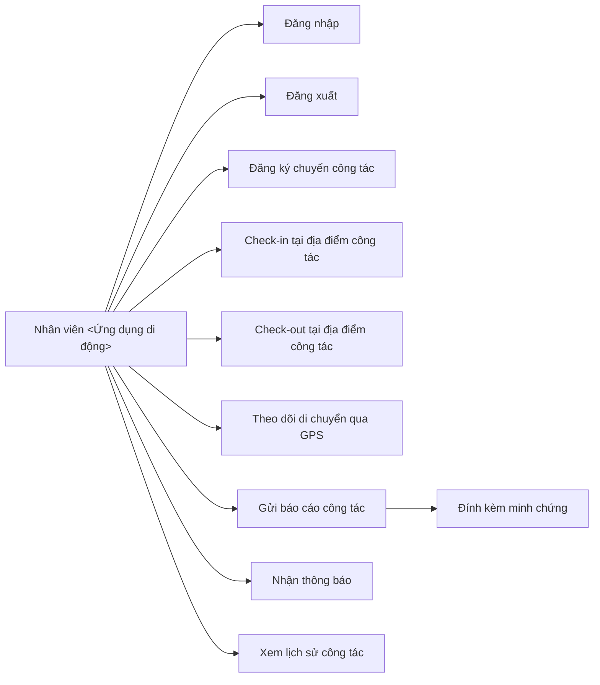

**Use Case của Quản lý (Ứng dụng Web)**

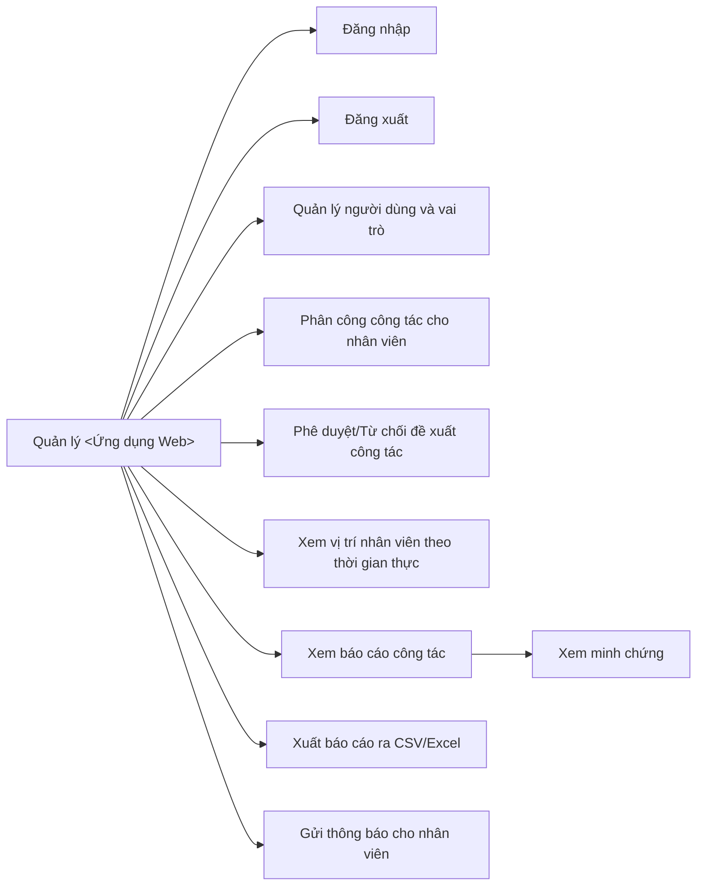

### Ghi chú thiết kế cơ sở dữ liệu
- Sử dụng MySQL cho dữ liệu giao dịch (người dùng, chuyến công tác, chấm công).
- Lưu trữ file minh chứng trên Google Cloud Storage.
- Sử dụng Redis để cache thông báo hoặc toạ độ GPS hiện tại cho bản đồ trực tuyến.

### Lưu ý bảo mật
- Sử dụng xác thực JWT.
- Phân quyền dựa trên vai trò (RBAC): Quản lý và Nhân viên.
- Kiểm tra dữ liệu tải lên (kích thước, định dạng).
- Đảm bảo truy cập an toàn tới cloud storage (signed URL hoặc phân quyền bucket).

### Tích hợp bên thứ ba
- OpenStreetMap + Leaflet.js: Hiển thị bản đồ và lộ trình công tác.
- Firebase Cloud Messaging (Tùy chọn): Gửi thông báo thời gian thực cho di động.

## Sơ đồ tuần tự các use case chính

### 1. Sơ đồ tuần tự: Gửi đề xuất công tác

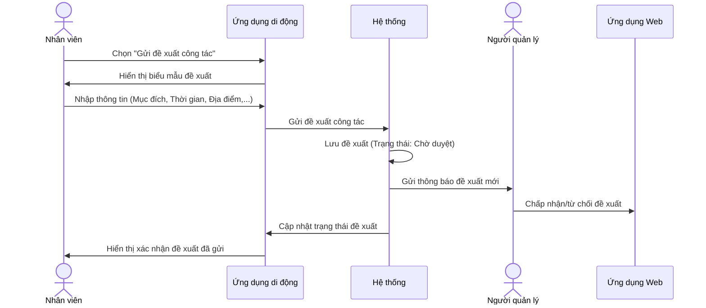

-----

### 2. Sơ đồ tuần tự: Chấm công (Check-in/Check-out) tại địa điểm công tác

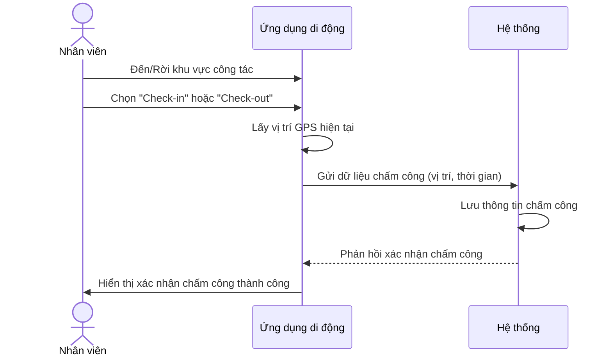

-----

### 3. Sơ đồ tuần tự: Báo cáo nội dung công tác

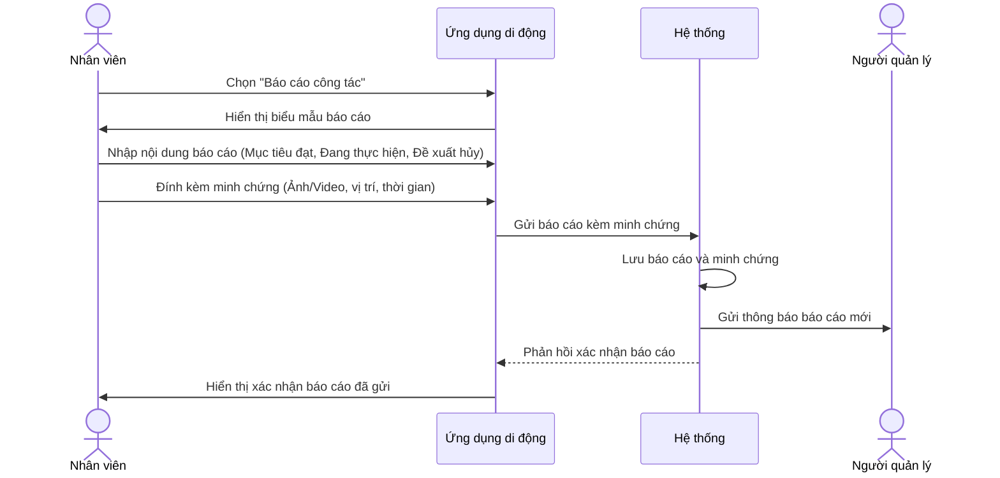

-----

### 4. Sơ đồ tuần tự: Nhận công tác hoặc thông báo

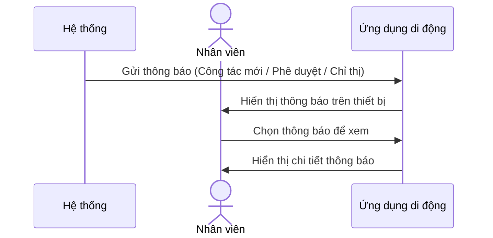

-----

### 5. Sơ đồ tuần tự: Phân công công tác

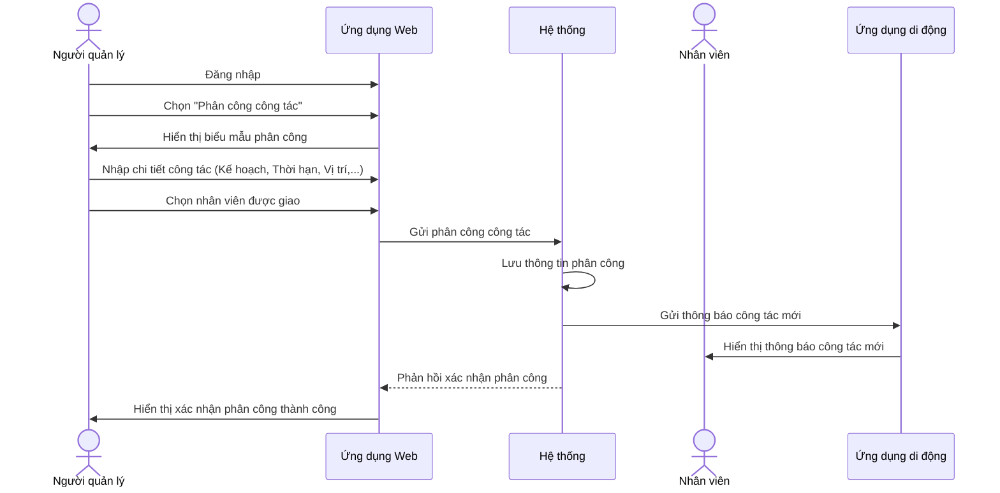

-----

### 6. Sơ đồ tuần tự: Phê duyệt đề xuất công tác

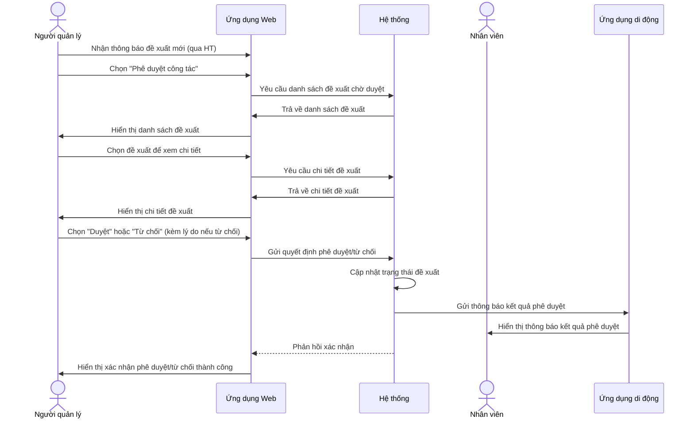

-----

### 7. Sơ đồ tuần tự: Giám sát công tác của nhân viên

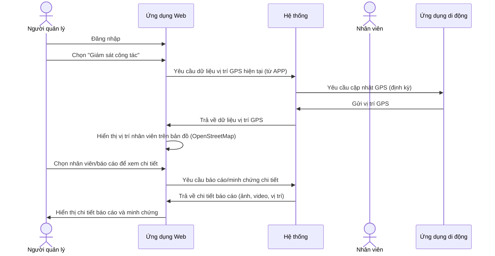

-----

### 8. Sơ đồ tuần tự: Tổng hợp dữ liệu và xuất báo cáo công tác

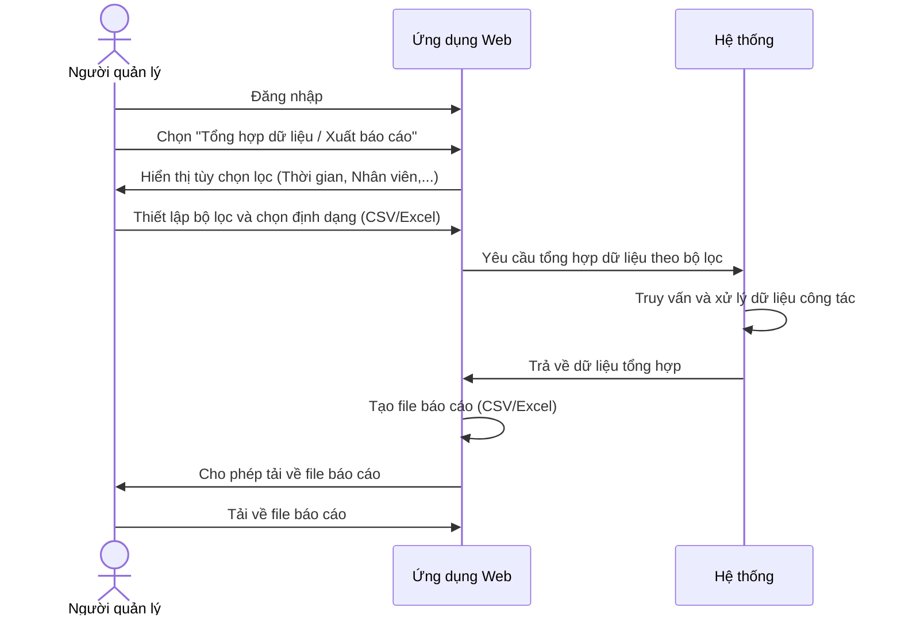

---

## Sơ đồ hoạt động chính của hệ thống

### 1. Gửi đề xuất công tác

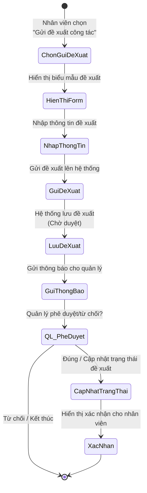

### 2. Chấm công (Check-in/Check-out)

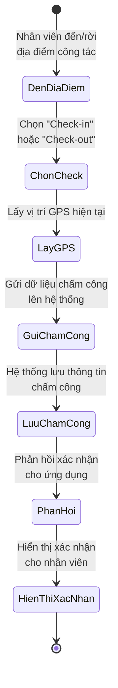

### 3. Báo cáo nội dung công tác

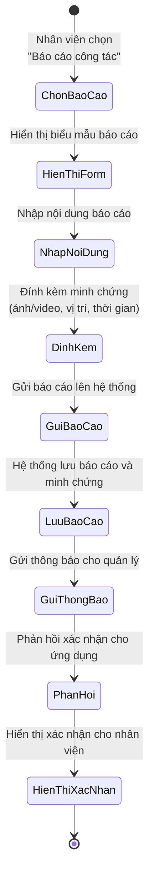

### 4. Nhận công tác hoặc thông báo

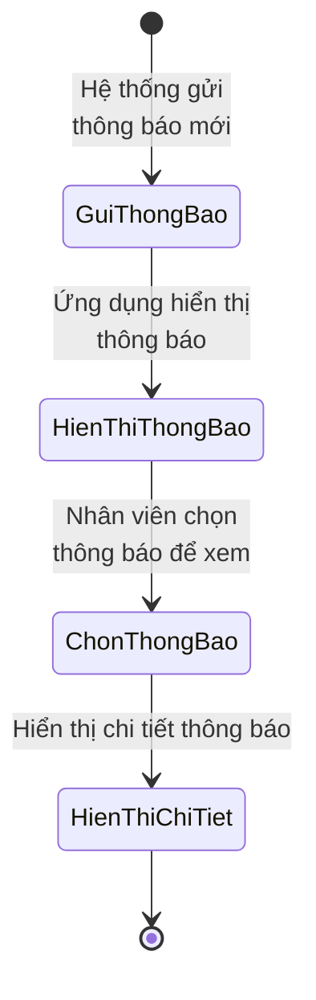

### 5. Phân công công tác

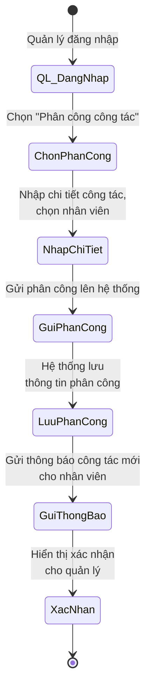

### 6. Phê duyệt đề xuất công tác

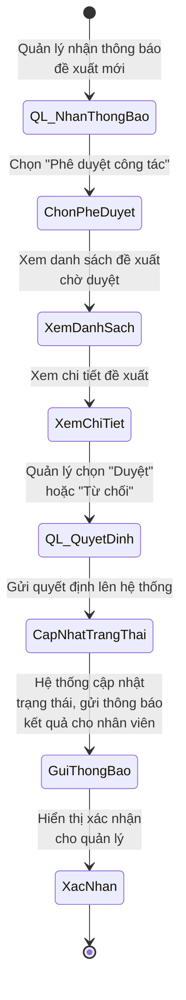

### 7. Giám sát công tác của nhân viên

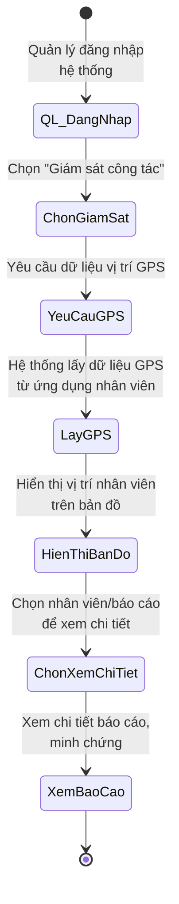

### 8. Tổng hợp dữ liệu và xuất báo cáo công tác

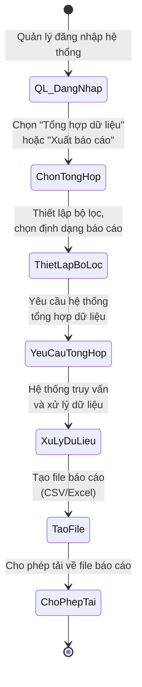

---

## Sơ đồ lớp hệ thống (Class Diagram)

**Các lớp Enum:**

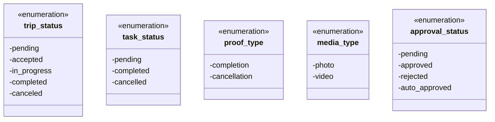

**Các lớp chính của hệ thống:**

```mermaid
classDiagram
    direction TB
    %% ROLES & PERMISSIONS
    class Role {
        -id: int
        -name: string
        -description: string
        -created_at: datetime
        -updated_at: datetime
        -deleted_at: datetime
    }
    class Permission {
        -id: int
        -action: string
        -resource: string
        -description: string
        -created_at: datetime
        -updated_at: datetime
        -deleted_at: datetime
    }
    class RolePermission {
        -role_id: int
        -permission_id: int
        -created_at: datetime
        -updated_at: datetime
    }

    %% USERS
    class User {
        -id: int
        -first_name: string
        -last_name: string
        -citizen_id: string
        -phone_number: string
        -gender: string
        -date_of_birth: date
        -email: string
        -password: string
        -role_id: int
        -created_at: datetime
        -updated_at: datetime
        -deleted_at: datetime
    }

    %% LOCATIONS
    class Location {
        -id: int
        -name: string
        -latitude: decimal
        -longitude: decimal
        -offset_radius: float
        -location: point
        -created_by: int
        -created_at: datetime
        -updated_at: datetime
        -deleted_at: datetime
    }

    %% TRIPS
    class Trip {
        -id: int
        -assignee_id: int
        -status: trip_status
        -purpose: string
        -goal: string
        -schedule: string
        -created_by: int
        -created_at: datetime
        -updated_at: datetime
        -deleted_at: datetime
    }

    class TripLocation {
        -id: int
        -trip_id: int
        -location_id: int
        -arrival_order: int
        -scheduled_at: datetime
        -created_at: datetime
        -updated_at: datetime
        -deleted_at: datetime
    }

    class TripApproval {
        -id: int
        -trip_id: int
        -approver_id: int
        -status: approval_status
        -note: string
        -is_auto: bool
        -created_at: datetime
    }

    %% TASKS
    class Task {
        -id: int
        -trip_location_id: int
        -title: string
        -description: string
        -status: task_status
        -note: string
        -deadline: datetime
        -completed_at: datetime
        -cancelled_at: datetime
        -cancel_reason: string
        -created_at: datetime
        -updated_at: datetime
    }

    class TaskProof {
        -id: int
        -task_id: int
        -type: proof_type
        -media_url: string
        -media_type: media_type
        -latitude: decimal
        -longitude: decimal
        -timestamp: datetime
        -uploaded_by: int
        -location_point: point
        -created_at: datetime
    }

    %% GPS LOGS
    class GPSLog {
        -id: int
        -trip_id: int
        -user_id: int
        -latitude: decimal
        -longitude: decimal
        -timestamp: datetime
        -location_point: point
    }

    %% EXPORT LOGS
    class ExportLog {
        -id: int
        -requested_by: int
        -export_type: string
        -filter_params: string
        -file_url: string
        -created_at: datetime
    }

    %% AUDIT LOGS
    %% class AuditLog {
    %%     -id: int
    %%     -user_id: int
    %%     -action: string
    %%     -entity: string
    %%     -entity_id: int
    %%     -description: string
    %%     -created_at: datetime
    %% }

    %% NOTIFICATIONS
    class Notification {
        -id: int
        -user_id: int
        -message: string
        -is_read: bool
        -created_at: datetime
    }

    %% RELATIONSHIPS
    %% Role -< User (1-n)
    Role "1" o-- "*" User : "assigned to"
    %% Role -< RolePermission >- Permission (n-n)
    Role "1" o-- "*" RolePermission : "has"
    Permission "1" o-- "*" RolePermission : "granted to"
    %% User -< Trip (1-n)
    User "1" o-- "*" Trip : "created by"
    %% User -< Location (1-n)
    User "1" o-- "*" Location : "created by"
    %% User -< TripApproval (1-n)
    User "1" o-- "*" TripApproval : "approves"
    %% User -< GPSLog (1-n)
    User "1" o-- "*" GPSLog : "logs"
    %% User -< ExportLog (1-n)
    User "1" o-- "*" ExportLog : "requests"
    %% User -< AuditLog (1-n)
    %% User "1" o-- "*" AuditLog : "actions"
    %% User -< Notification (1-n)
    User "1" o-- "*" Notification : "receives"
    %% User -< TaskProof (1-n)
    User "1" o-- "*" TaskProof : "uploads"

    %% Trip -< TripLocation (1-n)
    Trip "1" o-- "*" TripLocation : "includes"
    %% Trip -< TripApproval (1-n)
    Trip "1" o-- "*" TripApproval : "has"
    %% Trip -< GPSLog (1-n)
    Trip "1" o-- "*" GPSLog : "tracks"
    %% TripLocation -< Task (1-n)
    TripLocation "1" o-- "*" Task : "has"
    %% TripLocation >-- Location : "at" %% composition (TripLocation contains Location)
    TripLocation "*" *-- "1" Location : "at"
    %% Task -< TaskProof (1-n)
    Task "1" o-- "*" TaskProof : "has"
```

---

## Sơ đồ trạng thái chính của hệ thống

### 1. Sơ đồ trạng thái của Trip (Chuyến công tác)

```mermaid
stateDiagram-v2
    [*] --> pending : Tạo mới
    pending --> accepted : Được phê duyệt
    pending --> canceled : Bị hủy
    accepted --> in_progress : Bắt đầu công tác
    in_progress --> completed : Hoàn thành công tác
    in_progress --> canceled : Hủy trong quá trình
    accepted --> canceled : Hủy trước khi bắt đầu
```

### 2. Sơ đồ trạng thái của Task (Nhiệm vụ)

```mermaid
stateDiagram-v2
    [*] --> pending : Tạo mới
    pending --> completed : Đánh dấu hoàn thành
    pending --> cancelled : Hủy nhiệm vụ
    completed --> cancelled : Hủy sau khi hoàn thành (nếu có rollback)
```

### 3. Sơ đồ trạng thái của TripApproval (Phê duyệt công tác)

```mermaid
stateDiagram-v2
    [*] --> pending : Chờ phê duyệt
    pending --> approved : Được phê duyệt
    pending --> rejected : Bị từ chối
    pending --> auto_approved : Tự động phê duyệt
```

### 4. Sơ đồ trạng thái của Notification (Thông báo)

```mermaid
stateDiagram-v2
    [*] --> unread : Tạo mới
    unread --> read : Người dùng đã đọc
```

### 5. Sơ đồ trạng thái của Proof (Minh chứng)

```mermaid
stateDiagram-v2
    [*] --> completion : Nộp minh chứng hoàn thành
    [*] --> cancellation : Nộp minh chứng hủy
```

