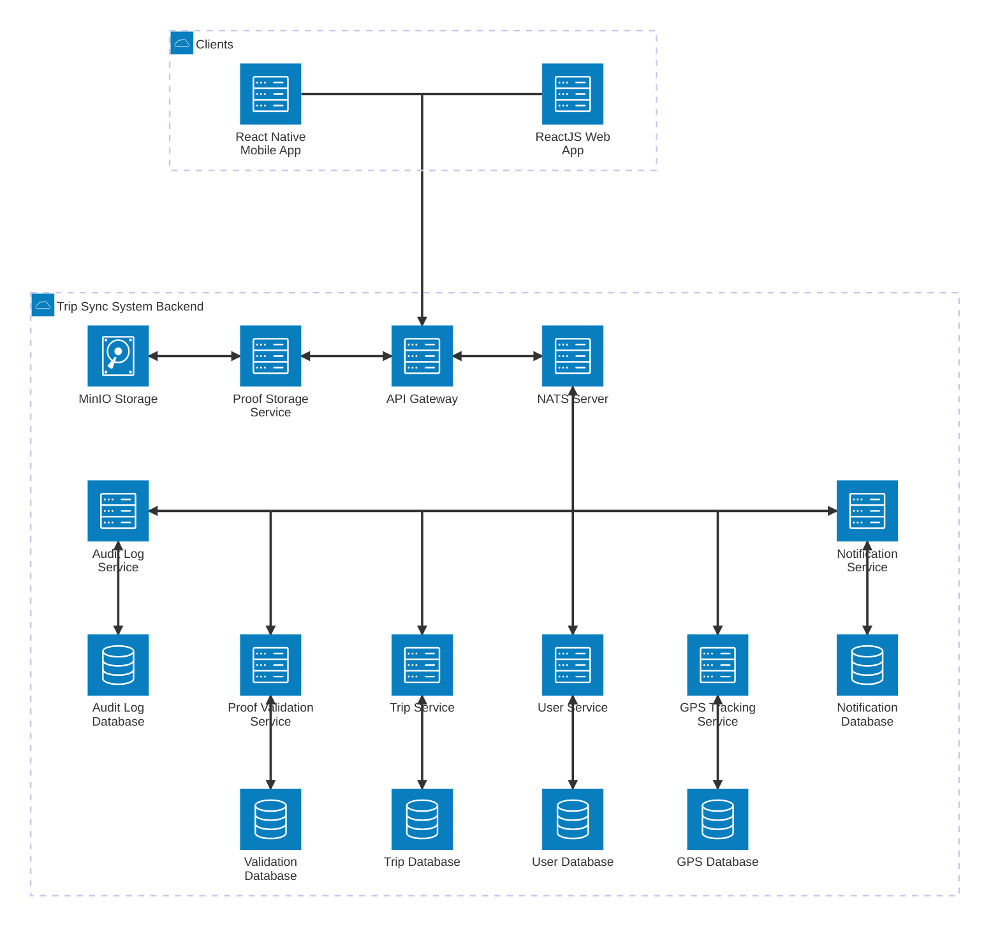

# Trip Sync System Design

---

<!-- @import "[TOC]" {cmd="toc" depthFrom=2 depthTo=6 orderedList=false} -->

<!-- code_chunk_output -->

- [Trip Sync System Entity](#trip-sync-system-entity)
- [Trip Sync System Architecture](#trip-sync-system-architecture)
  - [Trip Sync System Architecture Diagram](#trip-sync-system-architecture-diagram)
  - [Trip Sync Core Services](#trip-sync-core-services)
  - [Data and Storage Layer](#data-and-storage-layer)
  - [Cross-Service Communication](#cross-service-communication)
- [Trip Sync System Use Cases](#trip-sync-system-use-cases)

<!-- /code_chunk_output -->

---

## Trip Sync System Entity

These are the core entities of the Trip sync system:

- User: Trip Sync users are categorized into two main roles: Employee and Manager.
    - Employee: main users that using the Trip Sync mobile app that can suggest work trip outside of the company. Employee perform the assigned tasks in the trip at locations. After the task completion, employee will provide proofs to show that the task has been completed as expected. These proofs are images, videos, or documentations employess can upload into Trip Sync system using the provided app. Beside that main feature, they can view the trip list, trip information and their geological location in real-time.
    - Manager: users that use the Trip Sync web application who create trips with many locations and tasks to assign to other employees. Each trip will be asigned to one employee. Managers can track the geological location of the employees in real-time. Other than that, they can approve or decline trip suggestion from the employees, views trip list and manage employess's credentials. Employee's user accounts must be created by managers.
- Trip: A work trip of the company. A trip must have a schedule: when it begins and ends. A trip can have many locations so that the employee will be worked at. Each location can be assigned with many tasks. A trip can be created by a manager or suggested by the employee then later on will be accepted or declined by a manager.
- Location: A work trip will have many locations for the employee to work at. A location will have geological coordinate with name, offset radious for real-time tracking and check-in/check-out operation.
- Task: An employee will be worked at a location to solve many tasks. After completing a task, employee will need to submit proofs so that manager can ensure that the task completion is valid.
- Task proof: A task proof is an evidence which employee provide to the manager to get approval of their tasks. A proof can be images, videos, or documents such as PDF, Word, Excel or Powerpoints.

Some other supplementary entities:

- Permission: Permission is an approval for users to perform a specific action in the system.
- Role: Trip Sync system role allow users of the system have permission to perform some action in the system. One role can have many permission and one permission can belong to many roles.
- Notification: Trip sync system send a notification to users when an event is occured such as new trip suggestion, or employees send proofs for a task.

---

## Trip Sync System Architecture

Trip Sync operates as a multi-channel platform that serves managers on the web and employees on mobile devices. Both `ReactJS Web App` and `React Native Mobile App` communicate exclusively through the `API Gateway`, ensuring a consistent entry point that enforces authentication, rate control, and request orchestration across the backend ecosystem.

Trip Sync backend system follows the Microservices architecture and internal services of the system are domain-focused and interact over asynchronous messaging with publish/subcribe pattern. The gateway forwards synchronous CRUD-style traffic to the appropriate service, while the `NATS Server` provides publish/subscribe routing for events such as trip updates, proof submissions, and notifications. This combination keeps latency low for user-facing workflows while enabling eventual consistency across internal subsystems.

### Trip Sync System Architecture Diagram

### Trip Sync Core Services

- **User Service**: Manages user identities, credentials, roles, and permissions. It exposes APIs for onboarding employees, assigning managers, and authenticating sessions consumed by the gateway. It publishes role-change events to NATS so downstream services can adjust access scopes.
- **Trip Service**: Owns trip lifecycle logic—from creation and assignment to approval of employee-suggested trips. It maintains the canonical trip, location, and task data models, and reacts to proof validation and GPS events to update trip status.
- **GPS Tracking Service**: Ingests periodic location updates from mobile clients, validates them against the configured geofence radius per location, and streams the latest coordinates back to managers via the gateway. It emits location anomalies and check-in/check-out confirmations to the trip service through NATS.
- **Proof Validation Service**: Processes multimedia proofs submitted by employees. It coordinates with the storage service for asset retrieval, applies validation rules (file type, metadata, automated checks), and publishes approval or rejection outcomes to the trip service and notification service.
- **Notification Service**: Subscribes to high-level events (new trip assignments, proof decisions, approvals) and pushes real-time notifications to clients. It supports multi-channel delivery—mobile push, email, and web in-app alerts—abstracting notification templates and delivery providers.
- **Audit Log Service**: Records immutable audit events for critical actions such as permission changes, proof decisions, and trip status transitions. It consumes events from NATS and exposes a query API for compliance reporting and forensic analysis.

### Data and Storage Layer

The `Proof Storage Service` communicate directly to the `API gateway` for direct file uploading. Uploaded file URL then stored inside other services database. File will be stored inside a MinIO service by Digital Ocean for public access. By uploading file first, simple file validation such as file size, file type can be performed first and reduce load on the NATS server since NATS server is a message focus server, not suitable for large files.

### Cross-Service Communication

- The API gateway routes synchronous client calls to services like the user, trip, GPS tracking, and proof validation services, enforcing contracts and translating between external and internal schemas.
- Domain events travel via NATS, allowing services to react without tight coupling; for example, the trip service updates workflows based on proof validation events, and the notification service fans out user alerts.
- Shared infrastructure services (storage, notifications) expose stable interfaces so that new capabilities—such as additional notification channels or alternate storage providers—can be added without modifying core domain logic.

This architecture balances clear bounded contexts with responsive client experiences. Critical paths remain synchronous for immediacy, while asynchronous messaging preserves resilience and enables the system to scale horizontally as trip volume and user activity grow.

---

## Trip Sync System Use Cases

Trip Sync system use cases detailed information is at [here](./use-cases/README.md).
