# Sequence Diagram

## Gửi đề xuất công tác

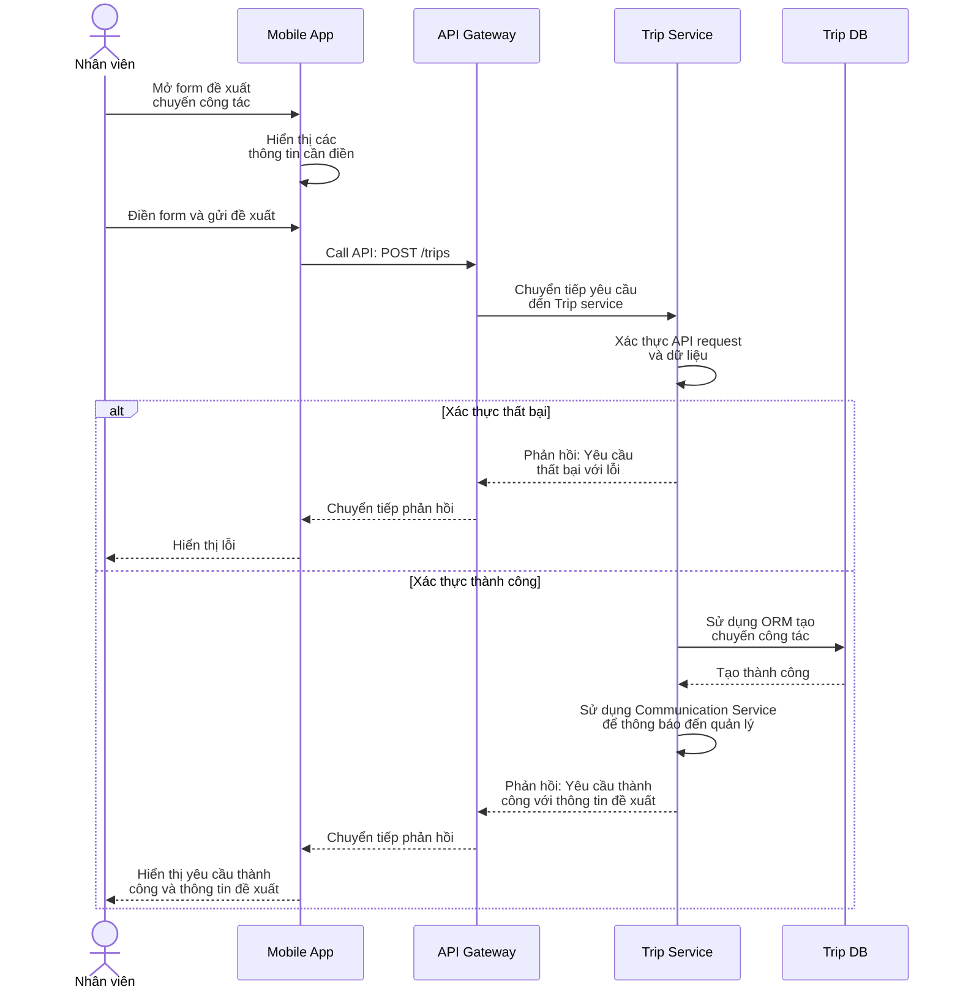
```mermaid
sequenceDiagram
    actor Employee as Nhân viên
    participant MobileApp as Mobile App
    participant APIGateway as API Gateway
    participant TripService as Trip Service
    participant Database as Trip DB

    Employee->>MobileApp: Mở form đề xuất<br/>chuyến công tác
    MobileApp->>MobileApp: Hiển thị các<br/>thông tin cần điền
    Employee->>MobileApp: Điền form và gửi đề xuất 
    MobileApp->>APIGateway: Call API: POST /trips
    APIGateway->>TripService: Chuyển tiếp yêu cầu<br/>đến Trip service
    TripService->>TripService: Xác thực API request<br/>và dữ liệu
    alt Xác thực thất bại
        TripService-->>APIGateway: Phản hồi: Yêu cầu<br/>thất bại với lỗi
        APIGateway-->>MobileApp: Chuyển tiếp phản hồi
        MobileApp-->>Employee: Hiển thị lỗi
    else Xác thực thành công
        TripService->>Database: Sử dụng ORM tạo<br/> chuyến công tác
        Database-->>TripService: Tạo thành công
        TripService->>TripService: Sử dụng Communication Service<br/>để thông báo đến quản lý
        TripService-->>APIGateway: Phản hồi: Yêu cầu thành<br/>công với thông tin đề xuất
        APIGateway-->>MobileApp: Chuyển tiếp phản hồi
        MobileApp-->>Employee: Hiển thị yêu cầu thành<br/>công và thông tin đề xuất
    end
```

## Chấm công (Check-in/Check-out)

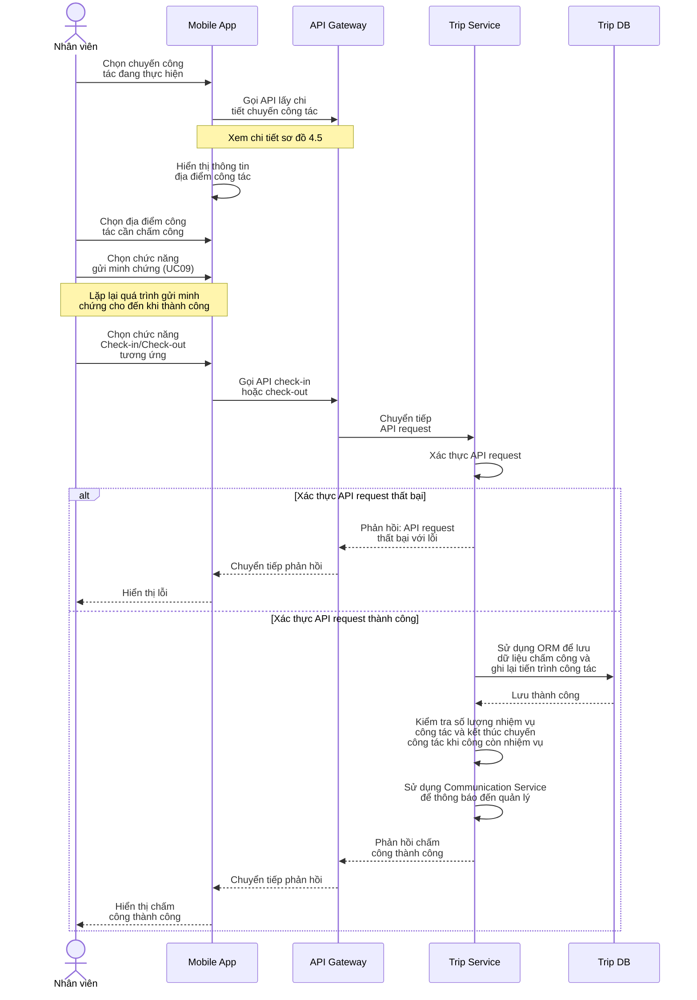
```mermaid
sequenceDiagram
    actor Employee as Nhân viên
    participant MobileApp as Mobile App
    participant APIGateway as API Gateway
    participant TripService as Trip Service
    participant Database as Trip DB

    Employee->>MobileApp: Chọn chuyến công<Br/>tác đang thực hiện
    MobileApp->>APIGateway: Gọi API lấy chi<br/>tiết chuyến công tác
    Note over MobileApp, APIGateway: Xem chi tiết sơ đồ 4.5
    MobileApp->>MobileApp: Hiển thị thông tin <br/>địa điểm công tác
    Employee->>MobileApp: Chọn địa điểm công<br/>tác cần chấm công
    Employee->>MobileApp: Chọn chức năng<br/>gửi minh chứng (UC09)

    Note over Employee, MobileApp: Lặp lại quá trình gửi minh<br/>chứng cho đến khi thành công

    Employee->>MobileApp: Chọn chức năng <br/>Check-in/Check-out <br/>tương ứng
    MobileApp->>APIGateway: Gọi API check-in <br/>hoặc check-out
    APIGateway->>TripService: Chuyển tiếp<br/>API request
    TripService->>TripService: Xác thực API request

    alt Xác thực API request thất bại
        TripService-->>APIGateway: Phản hồi: API request<br/>thất bại với lỗi
        APIGateway-->>MobileApp: Chuyển tiếp phản hồi
        MobileApp-->>Employee: Hiển thị lỗi
    else Xác thực API request thành công
        TripService->>Database: Sử dụng ORM để lưu<br/>dữ liệu chấm công và <br/>ghi lại tiến trình công tác
        Database-->>TripService: Lưu thành công
        TripService->>TripService: Kiểm tra số lượng nhiệm vụ<br/>công tác và kết thúc chuyến<br/>công tác khi công còn nhiệm vụ
        TripService->>TripService: Sử dụng Communication Service<br/>để thông báo đến quản lý
        TripService-->>APIGateway: Phản hồi chấm<br/>công thành công
        APIGateway-->>MobileApp: Chuyển tiếp phản hồi
        MobileApp-->>Employee: Hiển thị chấm<br/>công thành công
    end
```

## Gửi minh chứng

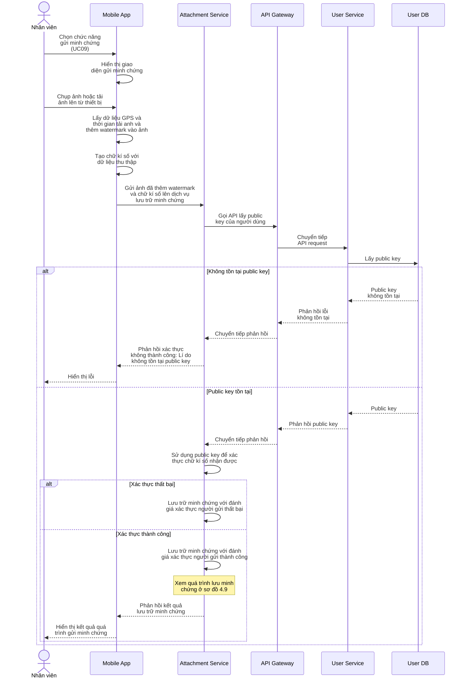
```mermaid
sequenceDiagram
    actor Employee as Nhân viên
    participant MobileApp as Mobile App
    participant AttachmentService as Attachment Service
    participant APIGateway as API Gateway
    participant UserService as User Service
    participant UserDB as User DB

    Employee->>MobileApp: Chọn chức năng<br/>gửi minh chứng<br/>(UC09)
    MobileApp->>MobileApp: Hiển thị giao<br/>diện gửi minh chứng
    Employee->>MobileApp: Chụp ảnh hoặc tải<br/>ảnh lên từ thiết bị
    MobileApp->>MobileApp: Lấy dữ liệu GPS và<br/>thời gian tải anh và<br/>thêm watermark vào ảnh
    MobileApp->>MobileApp: Tạo chữ kí số với<br/>dữ liệu thu thập
    MobileApp->>AttachmentService: Gửi ảnh đã thêm watermark<br/>và chữ kí số lên dịch vụ<br/>lưu trữ minh chứng
    AttachmentService->>APIGateway: Gọi API lấy public<br/>key của người dùng
    APIGateway->>UserService: Chuyển tiếp<br/>API request
    UserService->>UserDB: Lấy public key
    alt Không tồn tại public key
        UserDB-->>UserService: Public key<br/>không tồn tại
        UserService-->>APIGateway: Phản hồi lỗi<br/>không tồn tại
        APIGateway-->>AttachmentService: Chuyển tiếp phản hồi
        AttachmentService-->>MobileApp: Phản hồi xác thực<br/>không thành công: Lí do<br/>không tồn tại public key
        MobileApp-->>Employee: Hiển thị lỗi
    else Public key tồn tại
        UserDB-->>UserService: Public key
        UserService-->>APIGateway: Phản hồi public key
        APIGateway-->>AttachmentService: Chuyển tiếp phản hồi
        AttachmentService->>AttachmentService: Sử dụng public key để xác<br/>thực chữ kí số nhận được
        alt Xác thực thất bại
            AttachmentService->>AttachmentService: Lưu trữ minh chứng với đánh<br/>giá xác thực người gửi thất bại
        else Xác thực thành công
            AttachmentService->>AttachmentService: Lưu trữ minh chứng với đánh<br/>giá xác thực người gửi thành công
            Note over AttachmentService: Xem quá trình lưu minh<br/>chứng ở sơ đồ 4.9
            AttachmentService-->>MobileApp: Phản hồi kết quả<br/>lưu trữ minh chứng
            MobileApp-->>Employee: Hiển thị kết quả quá<br/>trình gửi minh chứng
        end
    end

```

### Lưu trữ minh chứng

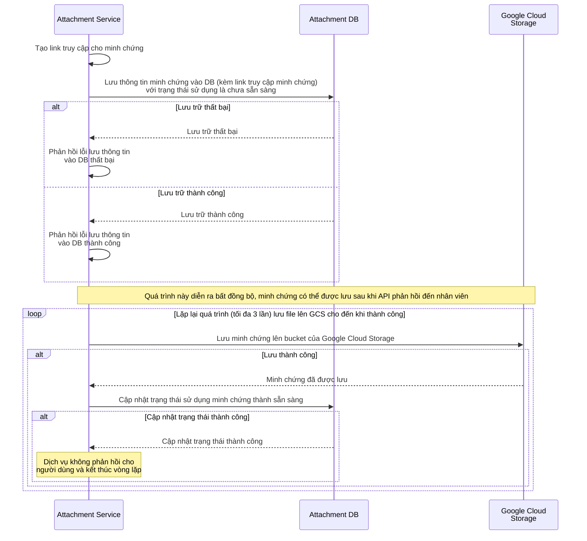
```mermaid
sequenceDiagram
    participant AttachmentService as Attachment Service
    participant AttachmentDB as Attachment DB
    participant GCS as Google Cloud<br/>Storage
    

    AttachmentService->>AttachmentService: Tạo link truy cập cho minh chứng
    AttachmentService->>AttachmentDB: Lưu thông tin minh chứng vào DB (kèm link truy cập minh chứng)<br/>với trạng thái sử dụng là chưa sẵn sàng
    alt Lưu trữ thất bại
        AttachmentDB-->>AttachmentService: Lưu trữ thất bại
        AttachmentService->>AttachmentService: Phản hồi lỗi lưu thông tin<br/>vào DB thất bại
    else Lưu trữ thành công
        AttachmentDB-->>AttachmentService: Lưu trữ thành công
        AttachmentService->>AttachmentService: Phản hồi lỗi lưu thông tin<br/>vào DB thành công
    end

    Note over AttachmentService, GCS: Quá trình này diễn ra bất đồng bộ, minh chứng có thể được lưu sau khi API phản hồi đến nhân viên
    loop Lặp lại quá trình (tối đa 3 lần) lưu file lên GCS cho đến khi thành công
        AttachmentService->>GCS: Lưu minh chứng lên bucket của Google Cloud Storage
        alt Lưu thành công
            GCS-->>AttachmentService: Minh chứng đã được lưu
            AttachmentService->>AttachmentDB: Cập nhật trạng thái sử dụng minh chứng thành sẵn sàng
            alt Cập nhật trạng thái thành công
                AttachmentDB-->>AttachmentService: Cập nhật trạng thái thành công
                note over AttachmentService: Dịch vụ không phản hồi cho<br/>người dùng và kết thúc vòng lặp
            end
        end            
    end
```

### Lấy minh chứng

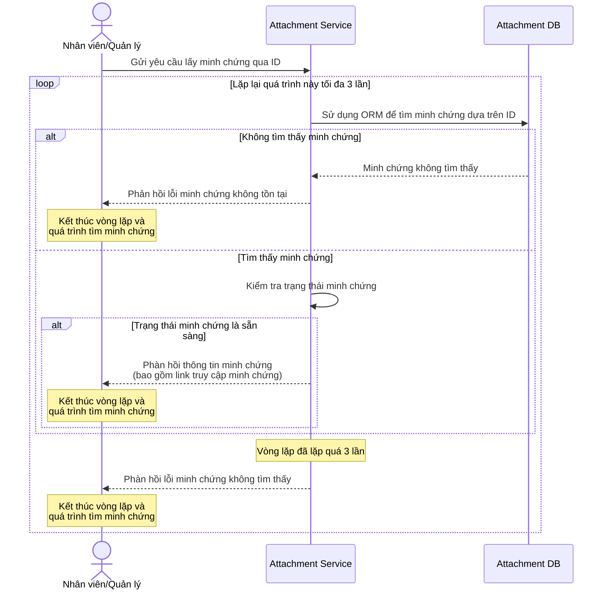
```mermaid
sequenceDiagram
    actor Actorr as Nhân viên/Quản lý
    participant AttachmentService as Attachment Service
    participant AttachmentDB as Attachment DB

    Actorr->>AttachmentService: Gửi yêu cầu lấy minh chứng qua ID
    loop Lặp lại quá trình này tối đa 3 lần
        AttachmentService->>AttachmentDB: Sử dụng ORM để tìm minh chứng dựa trên ID
        alt Không tìm thấy minh chứng
            AttachmentDB-->>AttachmentService: Minh chứng không tìm thấy
            AttachmentService-->>Actorr: Phản hồi lỗi minh chứng không tồn tại
            note over Actorr: Kết thúc vòng lặp và<br/>quá trình tìm minh chứng
        else Tìm thấy minh chứng
            AttachmentService->>AttachmentService: Kiểm tra trạng thái minh chứng
            alt Trạng thái minh chứng là sẵn sàng
                AttachmentService-->>Actorr: Phàn hồi thông tin minh chứng<br/>(bao gồm link truy cập minh chứng)
                note over Actorr: Kết thúc vòng lặp và<br/>quá trình tìm minh chứng
            end
        end
        note over AttachmentService: Vòng lặp đã lặp quá 3 lần
        AttachmentService-->>Actorr: Phàn hồi lỗi minh chứng không tìm thấy
        note over Actorr: Kết thúc vòng lặp và<br/>quá trình tìm minh chứng
    end
```

## Phân công công tác

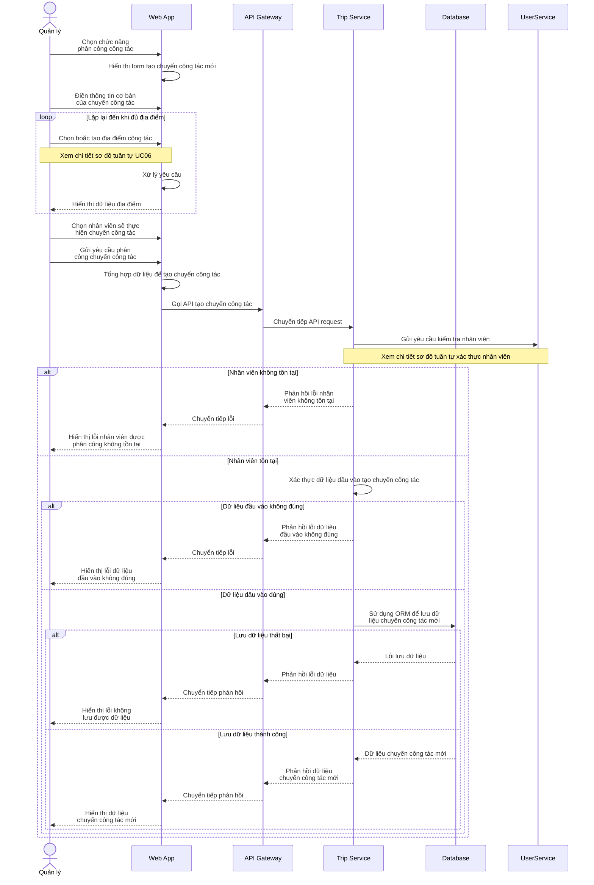
```mermaid
sequenceDiagram
    actor Manager as Quản lý
    participant WebApp as Web App
    participant APIGateway as API Gateway
    participant TripService as Trip Service
    participant Database

    Manager->>WebApp: Chọn chức năng<br/>phân công công tác
    WebApp->>WebApp: Hiển thị form tạo chuyến công tác mới
    Manager->>WebApp: Điền thông tin cơ bản<br/>của chuyến công tác
    loop Lặp lại đến khi đủ địa điểm
        Manager->>WebApp: Chọn hoặc tạo địa điểm công tác
        Note over Manager, WebApp: Xem chi tiết sơ đồ tuần tự UC06
        WebApp->>WebApp: Xử lý yêu cầu
        WebApp-->>Manager: Hiển thị dữ liệu địa điểm 
    end
    Manager->>WebApp: Chọn nhân viên sẽ thực<br/>hiện chuyến công tác
    Manager->>WebApp: Gửi yêu cầu phân<br/>công chuyến công tác
    WebApp->>WebApp: Tổng hợp dữ liệu để tạo chuyến công tác
    WebApp->>APIGateway: Gọi API tạo chuyến công tác
    APIGateway->>TripService: Chuyển tiếp API request
    TripService->>UserService: Gửi yêu cầu kiểm tra nhân viên
    Note over TripService, UserService: Xem chi tiết sơ đồ tuần tự xác thực nhân viên
    alt Nhân viên không tồn tại
        TripService-->>APIGateway: Phản hồi lỗi nhân<br/>viên không tồn tại
        APIGateway-->>WebApp: Chuyển tiếp lỗi
        WebApp-->>Manager: Hiển thị lỗi nhân viên được<br/>phân công không tồn tại
    else Nhân viên tồn tại
        TripService->>TripService: Xác thực dữ liệu đầu vào tạo chuyến công tác
        alt Dữ liệu đầu vào không đúng
            TripService-->>APIGateway: Phản hồi lỗi dữ liệu<br/>đầu vào không đúng
            APIGateway-->>WebApp: Chuyển tiếp lỗi
            WebApp-->>Manager: Hiển thị lỗi dữ liệu<br/>đầu vào không đúng
        else Dữ liệu đầu vào đúng
            TripService->>Database: Sử dụng ORM để lưu dữ<br/>liệu chuyến công tác mới
            alt Lưu dữ liệu thất bại
                Database-->>TripService: Lỗi lưu dữ liệu
                TripService-->>APIGateway: Phản hồi lỗi dữ liệu
                APIGateway-->>WebApp: Chuyển tiếp phản hồi
                WebApp-->>Manager: Hiển thị lỗi không<br/>lưu được dữ liệu
            else Lưu dữ liệu thành công
                Database-->>TripService: Dữ liệu chuyến công tác mới
                TripService-->>APIGateway: Phản hồi dữ liệu<br/>chuyến công tác mới
                APIGateway-->>WebApp: Chuyển tiếp phản hồi
                WebApp-->>Manager: Hiển thị dữ liệu<br/>chuyến công tác mới
            end
        end
    end
```

### Sơ đồ tuần tự tạo hoặc tìm kiếm và chọn địa điểm công tác

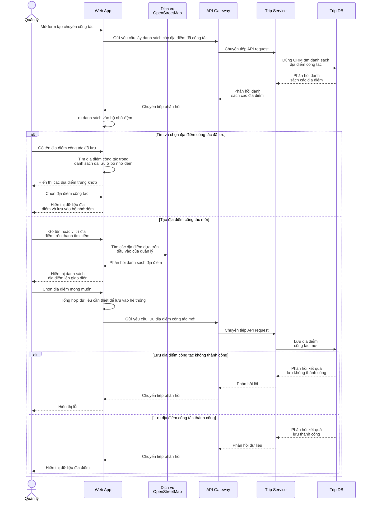
```mermaid
sequenceDiagram
    actor Manager as Quản lý
    participant WebApp as Web App
    participant OpenStreetMap as Dịch vụ<br/>OpenStreetMap
    participant APIGateway as API Gateway
    participant TripService as Trip Service
    participant Database as Trip DB

    Manager->>WebApp: Mở form tạo chuyến công tác
    WebApp->>APIGateway: Gửi yêu cầu lấy danh sách các địa điểm đã công tác
    APIGateway->>TripService: Chuyển tiếp API request
    TripService->>Database: Dùng ORM tìm danh sách<br/>địa điểm công tác
    Database-->>TripService: Phản hồi danh<br/>sách các địa điểm
    TripService-->>APIGateway: Phản hồi danh<br/>sách các địa điểm
    APIGateway-->>WebApp: Chuyển tiếp phản hồi
    WebApp->>WebApp: Lưu danh sách vào bộ nhớ đệm

    alt Tìm và chọn địa điểm công tác đã lưu
        Manager->>WebApp: Gõ tên địa điểm công tác đã lưu
        WebApp->>WebApp: Tìm địa điểm công tác trong<br/>danh sách đã lưu ở bộ nhớ đệm
        WebApp-->>Manager: Hiển thị các địa điểm trùng khớp
        Manager->>WebApp: Chọn địa điểm công tác
        WebApp-->>Manager: Hiển thị dữ liệu địa<br/>điểm và lưu vào bộ nhớ đệm
    else Tạo địa điểm công tác mới 
        Manager->>WebApp: Gõ tên hoặc vị trí địa<br/>điểm trên thanh tìm kiếm
        WebApp->>OpenStreetMap: Tìm các địa điểm dựa trên<br/>đầu vào của quản lý
        OpenStreetMap-->>WebApp: Phản hồi danh sách địa điểm
        WebApp-->>Manager: Hiển thị danh sách<br/>địa điểm lên giao diện
        Manager->>WebApp: Chọn địa điểm mong muốn
        WebApp->>WebApp: Tổng hợp dữ liệu cần thiết để lưu vào hệ thống
        WebApp->>APIGateway: Gửi yêu cầu lưu địa điểm công tác mới
        APIGateway->>TripService: Chuyển tiếp API request
        TripService->>Database: Lưu địa điểm<br/>công tác mới
        alt Lưu địa điểm công tác không thành công
            Database-->>TripService: Phản hồi kết quả<br/>lưu không thành công
            TripService-->>APIGateway: Phản hồi lỗi
            APIGateway-->>WebApp: Chuyển tiếp phản hồi
            WebApp-->>Manager: Hiển thị lỗi
        else Lưu địa điểm công tác thành công
            Database-->>TripService: Phản hồi kết quả<br/>lưu thành công
            TripService-->>APIGateway: Phản hồi dữ liệu
            APIGateway-->>WebApp: Chuyển tiếp phản hồi
            WebApp-->>Manager: Hiển thị dữ liệu địa điểm
        end
    end
```

### Sơ đồ tuần tự quá trình xác thực nhân viên

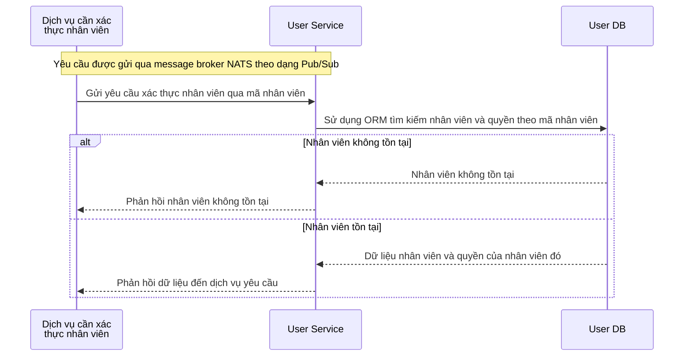
```mermaid
sequenceDiagram
    participant ActorService as Dịch vụ cần xác<br/>thực nhân viên
    participant UserService as User Service
    participant Database as User DB

    Note over ActorService, UserService: Yêu cầu được gửi qua message broker NATS theo dạng Pub/Sub
    ActorService->>UserService: Gửi yêu cầu xác thực nhân viên qua mã nhân viên
    UserService->>Database: Sử dụng ORM tìm kiếm nhân viên và quyền theo mã nhân viên
    alt Nhân viên không tồn tại
        Database-->>UserService: Nhân viên không tồn tại
        UserService-->>ActorService: Phản hồi nhân viên không tồn tại
    else Nhân viên tồn tại
        Database-->>UserService: Dữ liệu nhân viên và quyền của nhân viên đó
        UserService-->>ActorService: Phản hồi dữ liệu đến dịch vụ yêu cầu
    end
```

Sơ đồ này mô tả cho quá trình gọi các dịch vụ nội bộ trong hệ thông microservices

## Sơ đồ tuần tự use case xem chi tiết công tác - UC05

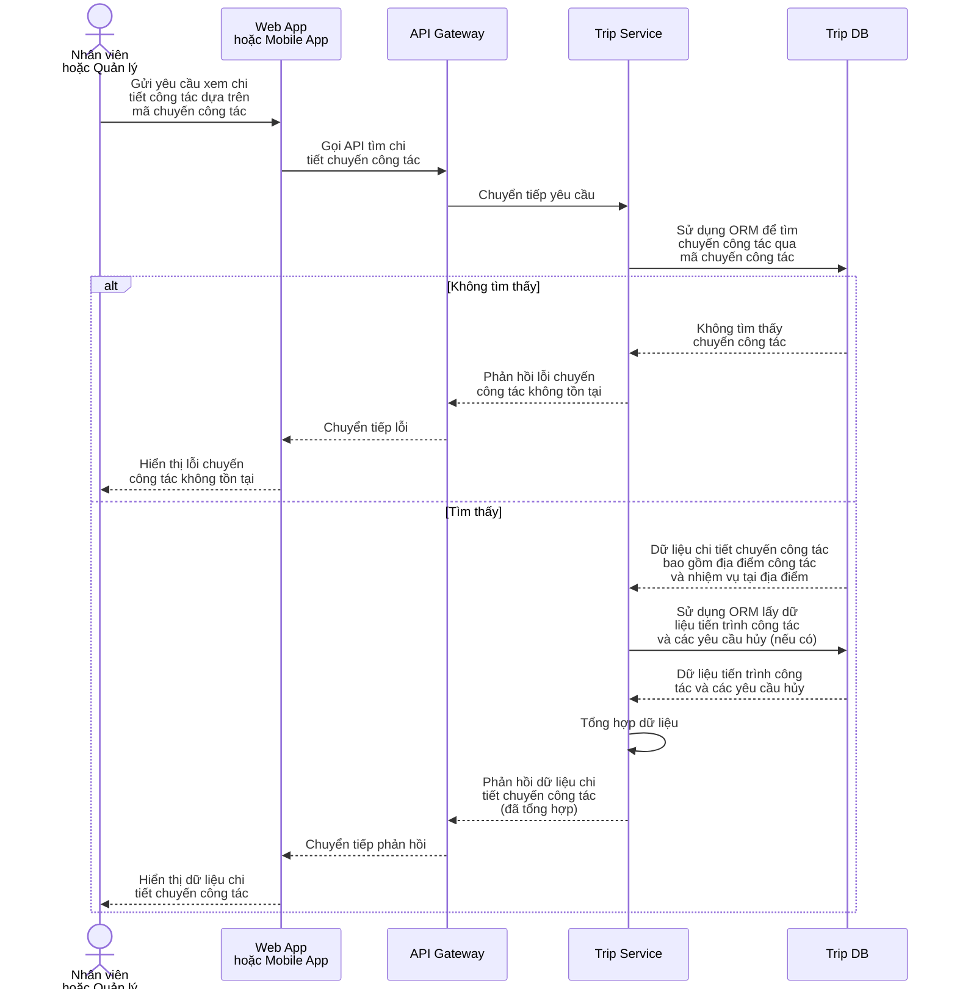
```mermaid
sequenceDiagram
    actor User as Nhân viên<br/>hoặc Quản lý
    participant App as Web App<br/> hoặc Mobile App
    participant APIGateway as API Gateway
    participant TripService as Trip Service
    participant Database as Trip DB

    User->>App: Gửi yêu cầu xem chi<br/>tiết công tác dựa trên<br/>mã chuyến công tác
    App->>APIGateway: Gọi API tìm chi<br/>tiết chuyến công tác
    APIGateway->>TripService: Chuyển tiếp yêu cầu
    TripService->>Database: Sử dụng ORM để tìm<br/>chuyến công tác qua<br/>mã chuyến công tác
    alt Không tìm thấy
        Database-->>TripService: Không tìm thấy<br/>chuyến công tác
        TripService-->>APIGateway: Phản hồi lỗi chuyến<br/>công tác không tồn tại
        APIGateway-->>App: Chuyển tiếp lỗi
        App-->>User: Hiển thị lỗi chuyến<br/>công tác không tồn tại
    else Tìm thấy
        Database-->>TripService: Dữ liệu chi tiết chuyến công tác<br/>bao gồm địa điểm công tác<br/>và nhiệm vụ tại địa điểm
        TripService->>Database: Sử dụng ORM lấy dữ<br/>liệu tiến trình công tác<br/>và các yêu cầu hủy (nếu có)
        Database-->>TripService: Dữ liệu tiến trình công<br/>tác và các yêu cầu hủy
        TripService->>TripService: Tổng hợp dữ liệu
        TripService-->>APIGateway: Phản hồi dữ liệu chi<br/>tiết chuyến công tác<br/>(đã tổng hợp)
        APIGateway-->>App: Chuyển tiếp phản hồi
        App-->>User: Hiển thị dữ liệu chi<br/>tiết chuyến công tác
    end
    
```

## Sơ đồ tuần tự use case quyết định đề xuất công tác

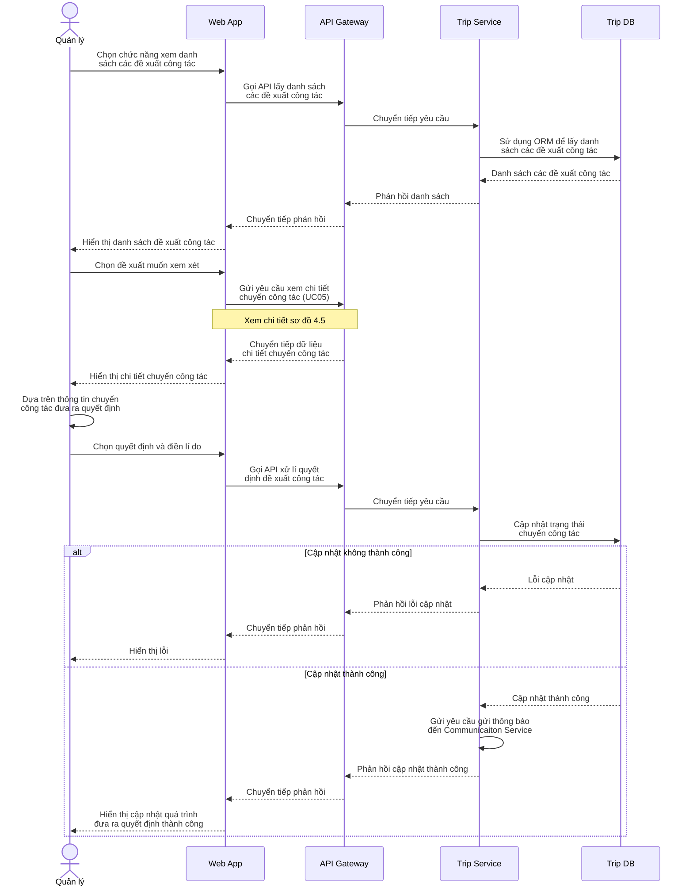
```mermaid
sequenceDiagram
    actor Manager as Quản lý
    participant WebApp as Web App
    participant APIGateway as API Gateway
    participant TripService as Trip Service
    participant Database as Trip DB

    Manager->>WebApp: Chọn chức năng xem danh<br/>sách các đề xuất công tác
    WebApp->>APIGateway: Gọi API lấy danh sách<br/>các đề xuất công tác
    APIGateway->>TripService: Chuyển tiếp yêu cầu
    TripService->>Database: Sử dụng ORM để lấy danh<br/>sách các đề xuất công tác
    Database-->>TripService: Danh sách các đề xuất công tác
    TripService-->>APIGateway: Phản hồi danh sách
    APIGateway-->>WebApp: Chuyển tiếp phản hồi
    WebApp-->>Manager: Hiển thị danh sách đề xuất công tác
    Manager->>WebApp: Chọn đề xuất muốn xem xét
    WebApp->>APIGateway: Gửi yêu cầu xem chi tiết<br/>chuyến công tác (UC05)
    Note over WebApp, APIGateway: Xem chi tiết sơ đồ 4.5
    APIGateway-->>WebApp: Chuyển tiếp dữ liệu<br/>chi tiết chuyến công tác
    WebApp-->>Manager: Hiển thị chi tiết chuyến công tác
    Manager->>Manager: Dựa trên thông tin chuyến<br/>công tác đưa ra quyết định
    Manager->>WebApp: Chọn quyết định và điền lí do
    WebApp->>APIGateway: Gọi API xử lí quyết<br/>định đề xuất công tác
    APIGateway->>TripService: Chuyển tiếp yêu cầu
    TripService->>Database: Cập nhật trạng thái<br/>chuyến công tác
    alt Cập nhật không thành công
        Database-->>TripService: Lỗi cập nhật
        TripService-->>APIGateway: Phản hồi lỗi cập nhật
        APIGateway-->>WebApp: Chuyển tiếp phản hồi
        WebApp-->>Manager: Hiển thị lỗi
    else Cập nhật thành công
        Database-->>TripService: Cập nhật thành công
        TripService->>TripService: Gửi yêu cầu gửi thông báo<br/>đến Communicaiton Service
        TripService-->>APIGateway: Phản hồi cập nhật thành công
        APIGateway-->>WebApp: Chuyển tiếp phản hồi
        WebApp-->>Manager: Hiển thị cập nhật quá trình<br/>đưa ra quyết định thành công
    end
```

## Sơ đồ tuần tự giám sát công tác của nhân viên

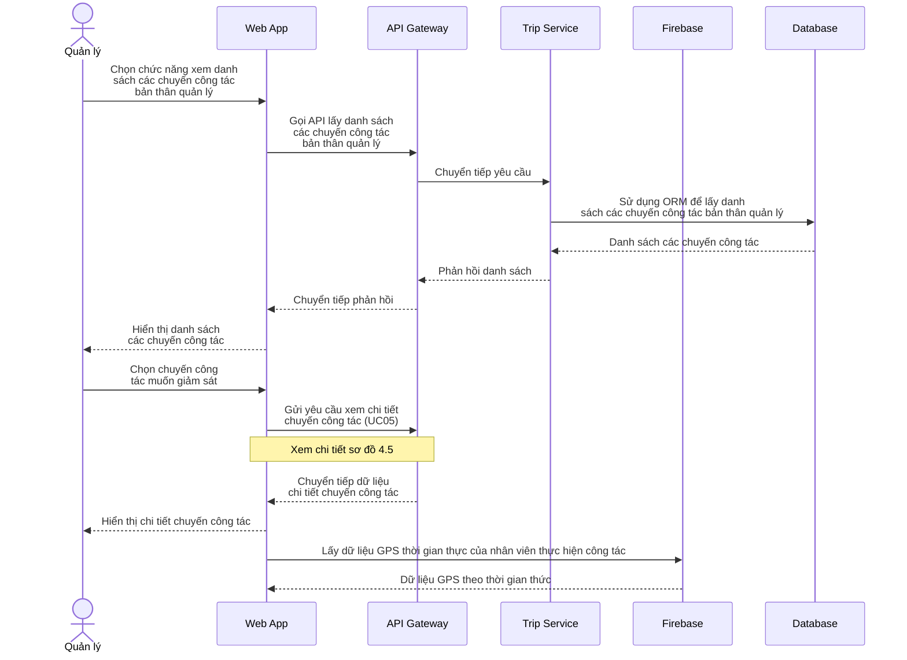
```mermaid
sequenceDiagram
    actor Manager as Quản lý
    participant WebApp as Web App
    participant APIGateway as API Gateway
    participant TripService as Trip Service
    participant Firebase
    participant Database

    Manager->>WebApp: Chọn chức năng xem danh<br/>sách các chuyến công tác<br/>bản thân quản lý
    WebApp->>APIGateway: Gọi API lấy danh sách<br/>các chuyến công tác<br/>bản thân quản lý
    APIGateway->>TripService: Chuyển tiếp yêu cầu
    TripService->>Database: Sử dụng ORM để lấy danh<br/>sách các chuyến công tác bản thân quản lý
    Database-->>TripService: Danh sách các chuyến công tác
    TripService-->>APIGateway: Phản hồi danh sách
    APIGateway-->>WebApp: Chuyển tiếp phản hồi
    WebApp-->>Manager: Hiển thị danh sách<br/>các chuyến công tác
    Manager->>WebApp: Chọn chuyến công<br/>tác muốn giảm sát
    WebApp->>APIGateway: Gửi yêu cầu xem chi tiết<br/>chuyến công tác (UC05)
    Note over WebApp, APIGateway: Xem chi tiết sơ đồ 4.5
    APIGateway-->>WebApp: Chuyển tiếp dữ liệu<br/>chi tiết chuyến công tác
    WebApp-->>Manager: Hiển thị chi tiết chuyến công tác
    WebApp->>Firebase: Lấy dữ liệu GPS thời gian thực của nhân viên thực hiện công tác
    Firebase-->>WebApp: Dữ liệu GPS theo thời gian thức
```

## Sơ đồ tuần tự xem thống kê hiệu suất công tác - UC22

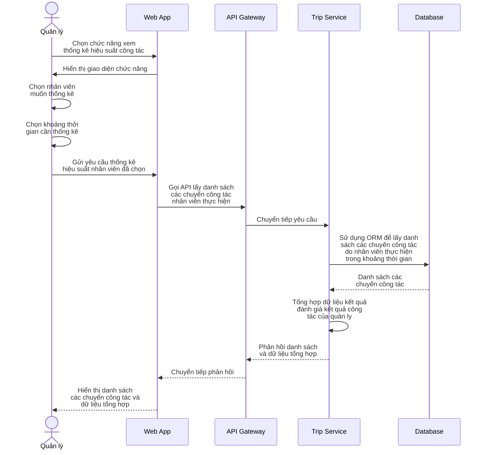
```mermaid
sequenceDiagram
    actor Manager as Quản lý
    participant WebApp as Web App
    participant APIGateway as API Gateway
    participant TripService as Trip Service
    participant Database

    Manager->>WebApp: Chọn chức năng xem<br/>thống kê hiệu suất công tác
    WebApp->>Manager: Hiển thị giao diện chức năng
    Manager->>Manager: Chọn nhân viên<br/>muốn thống kê 
    Manager->>Manager: Chọn khoảng thởi<br/>gian cần thống kê
    Manager->>WebApp: Gửi yêu cầu thống kê<br/>hiệu suất nhân viên đã chọn
    WebApp->>APIGateway: Gọi API lấy danh sách<br/>các chuyến công tác<br/>nhân viên thực hiện
    APIGateway->>TripService: Chuyển tiếp yêu cầu
    TripService->>Database: Sử dụng ORM để lấy danh<br/>sách các chuyến công tác<br/>do nhân viên thực hiện<br/>trong khoảng thời gian
    Database-->>TripService: Danh sách các<br/>chuyến công tác
    TripService->>TripService: Tổng hợp dữ liệu kết quả<br/>đánh giá kết quả công<br/>tác của quản ly
    TripService-->>APIGateway: Phản hồi danh sách<br/>và dữ liệu tổng hợp
    APIGateway-->>WebApp: Chuyển tiếp phản hồi
    WebApp-->>Manager: Hiển thị danh sách<br/>các chuyến công tác và <br/>dữ liệu tổng hợp
```

## Sơ đồ tuần tự đánh giá công tác - UC18

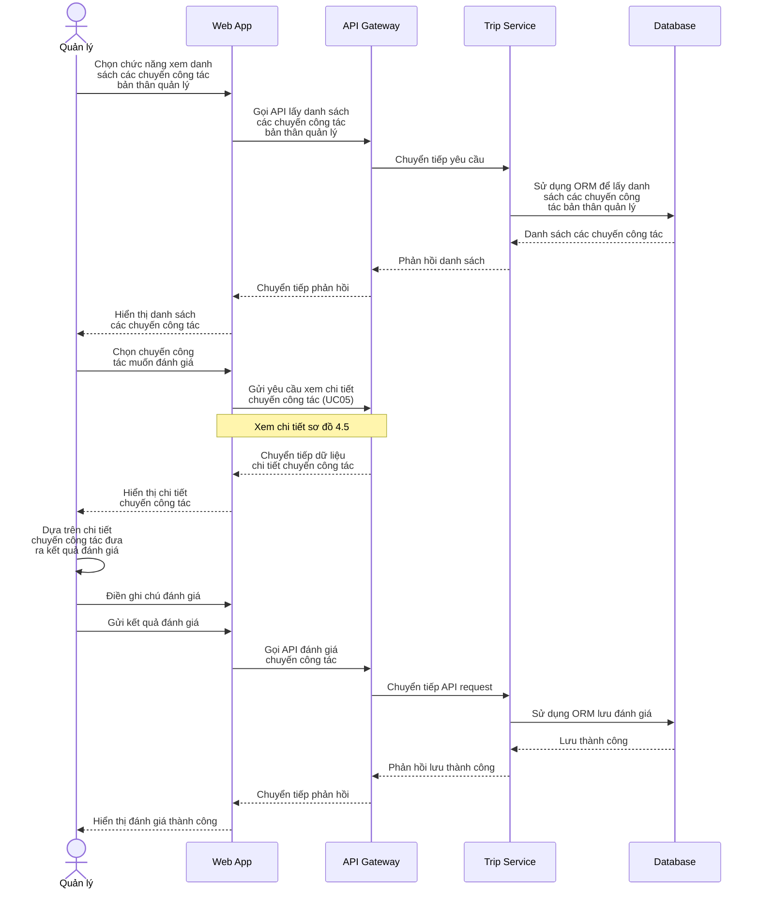
```mermaid
sequenceDiagram
    actor Manager as Quản lý
    participant WebApp as Web App
    participant APIGateway as API Gateway
    participant TripService as Trip Service
    participant Database

    Manager->>WebApp: Chọn chức năng xem danh<br/>sách các chuyến công tác<br/>bản thân quản lý
    WebApp->>APIGateway: Gọi API lấy danh sách<br/>các chuyến công tác<br/>bản thân quản lý
    APIGateway->>TripService: Chuyển tiếp yêu cầu
    TripService->>Database: Sử dụng ORM để lấy danh<br/>sách các chuyến công<br/>tác bản thân quản lý
    Database-->>TripService: Danh sách các chuyến công tác
    TripService-->>APIGateway: Phản hồi danh sách
    APIGateway-->>WebApp: Chuyển tiếp phản hồi
    WebApp-->>Manager: Hiển thị danh sách<br/>các chuyến công tác
    Manager->>WebApp: Chọn chuyến công<br/>tác muốn đánh giá
    WebApp->>APIGateway: Gửi yêu cầu xem chi tiết<br/>chuyến công tác (UC05)
    Note over WebApp, APIGateway: Xem chi tiết sơ đồ 4.5
    APIGateway-->>WebApp: Chuyển tiếp dữ liệu<br/>chi tiết chuyến công tác
    WebApp-->>Manager: Hiển thị chi tiết<br/>chuyến công tác
    Manager->>Manager: Dựa trên chi tiết<br/>chuyến công tác đưa<br/>ra kết quả đánh giá
    Manager->>WebApp: Điền ghi chú đánh giá
    Manager->>WebApp: Gửi kết quả đánh giá
    WebApp->>APIGateway: Gọi API đánh giá<br/>chuyến công tác
    APIGateway->>TripService: Chuyển tiếp API request
    TripService->>Database: Sử dụng ORM lưu đánh giá
    Database-->>TripService: Lưu thành công
    TripService-->>APIGateway: Phản hồi lưu thành công
    APIGateway-->>WebApp: Chuyển tiếp phản hồi
    WebApp-->>Manager: Hiển thị đánh giá thành công
```

## Sơ đồ tuần tự yêu cầu hủy chuyến/nhiệm vụ công tác - UC13

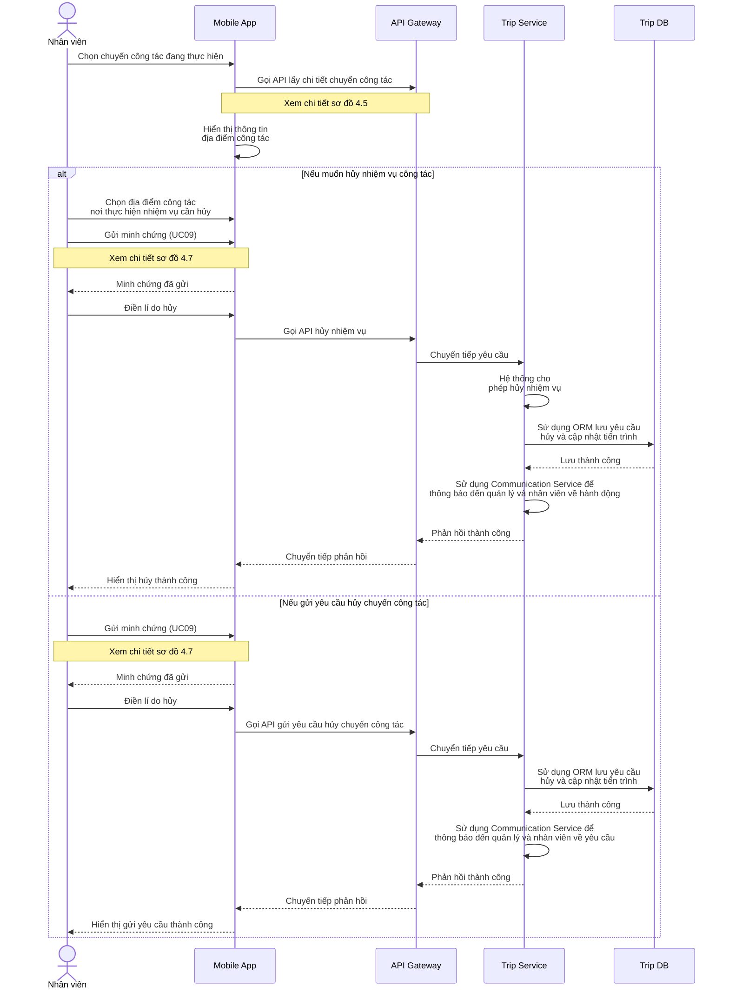
```mermaid
sequenceDiagram
    actor Emp as Nhân viên
    participant App as Mobile App
    participant Gateway as API Gateway
    participant TripService as Trip Service
    participant DB as Trip DB

    Emp->>App: Chọn chuyến công tác đang thực hiện
    App->>Gateway: Gọi API lấy chi tiết chuyến công tác
    Note over App, Gateway: Xem chi tiết sơ đồ 4.5
    App->>App: Hiển thị thông tin <br/>địa điểm công tác
    alt Nếu muốn hủy nhiệm vụ công tác
        Emp->>App: Chọn địa điểm công tác<br/>nơi thực hiện nhiệm vụ cần hủy
        Emp->>App: Gửi minh chứng (UC09)
        Note over Emp, App: Xem chi tiết sơ đồ 4.7
        App-->>Emp: Minh chứng đã gửi
        Emp->>App: Điền lí do hủy
        App->>Gateway: Gọi API hủy nhiệm vụ
        Gateway->>TripService: Chuyển tiếp yêu cầu
        TripService->>TripService: Hệ thống cho<br/>phép hủy nhiệm vụ
        TripService->>DB: Sử dụng ORM lưu yêu cầu<br/>hủy và cập nhật tiến trình
        DB-->>TripService: Lưu thành công
        TripService->>TripService: Sử dụng Communication Service để<br/>thông báo đến quản lý và nhân viên về hành động
        TripService-->>Gateway: Phản hồi thành công
        Gateway-->>App: Chuyển tiếp phản hồi
        App-->>Emp: Hiển thị hủy thành công
    else Nếu gửi yêu cầu hủy chuyến công tác
        Emp->>App: Gửi minh chứng (UC09)
        Note over Emp, App: Xem chi tiết sơ đồ 4.7
        App-->>Emp: Minh chứng đã gửi
        Emp->>App: Điền lí do hủy
        App->>Gateway: Gọi API gửi yêu cầu hủy chuyến công tác
        Gateway->>TripService: Chuyển tiếp yêu cầu
        TripService->>DB: Sử dụng ORM lưu yêu cầu<br/>hủy và cập nhật tiến trình
        DB-->>TripService: Lưu thành công
        TripService->>TripService: Sử dụng Communication Service để<br/>thông báo đến quản lý và nhân viên về yêu cầu
        TripService-->>Gateway: Phản hồi thành công
        Gateway-->>App: Chuyển tiếp phản hồi
        App-->>Emp: Hiển thị gửi yêu cầu thành công
    end
```

## Sơ đồ tuần tự hủy chuyến/nhiệm vụ công tác - UC19

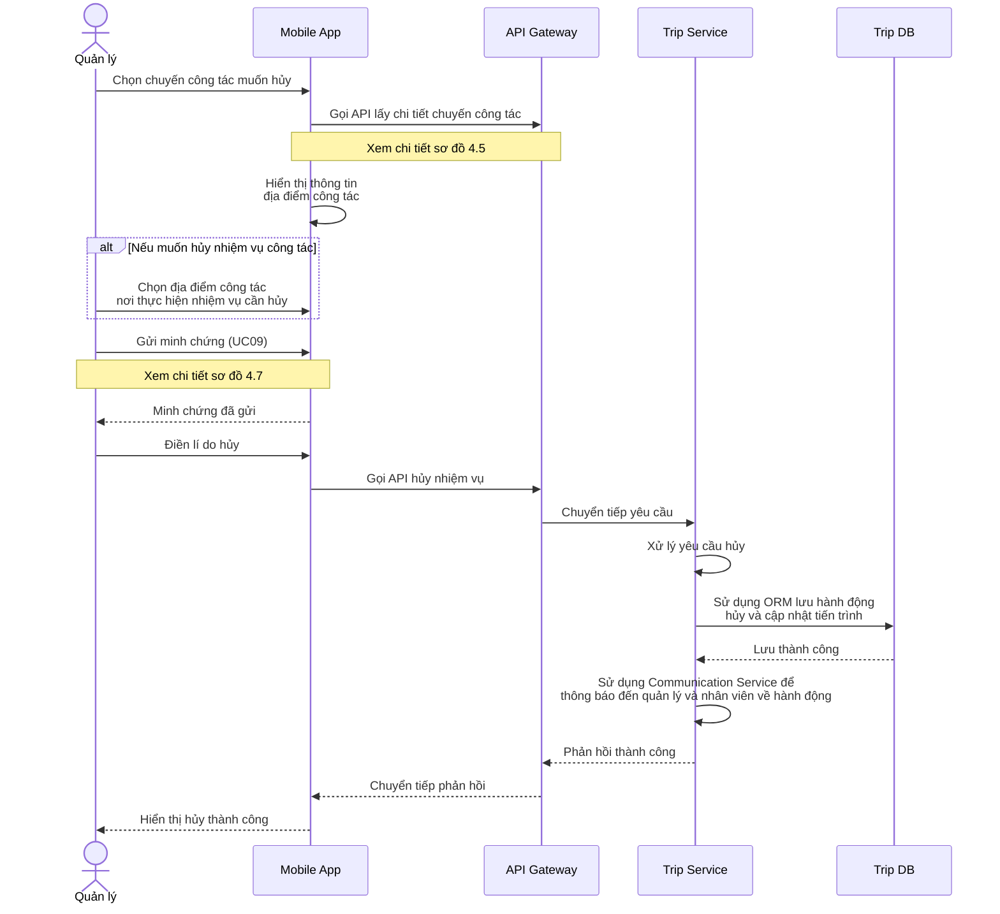
```mermaid
sequenceDiagram
    actor Emp as Quản lý
    participant App as Mobile App
    participant Gateway as API Gateway
    participant TripService as Trip Service
    participant DB as Trip DB

    Emp->>App: Chọn chuyến công tác muốn hủy
    App->>Gateway: Gọi API lấy chi tiết chuyến công tác
    Note over App, Gateway: Xem chi tiết sơ đồ 4.5
    App->>App: Hiển thị thông tin <br/>địa điểm công tác
    alt Nếu muốn hủy nhiệm vụ công tác
        Emp->>App: Chọn địa điểm công tác<br/>nơi thực hiện nhiệm vụ cần hủy
    end
    Emp->>App: Gửi minh chứng (UC09)
    Note over Emp, App: Xem chi tiết sơ đồ 4.7
    App-->>Emp: Minh chứng đã gửi
    Emp->>App: Điền lí do hủy
    App->>Gateway: Gọi API hủy nhiệm vụ
    Gateway->>TripService: Chuyển tiếp yêu cầu
    TripService->>TripService: Xử lý yêu cầu hủy
    TripService->>DB: Sử dụng ORM lưu hành động<br/>hủy và cập nhật tiến trình
    DB-->>TripService: Lưu thành công
    TripService->>TripService: Sử dụng Communication Service để<br/>thông báo đến quản lý và nhân viên về hành động
    TripService-->>Gateway: Phản hồi thành công
    Gateway-->>App: Chuyển tiếp phản hồi
    App-->>Emp: Hiển thị hủy thành công
```

## Sơ đồ tuần tự quyết định yêu cầu hủy chuyến/nhiệm vụ cong tác - UC20

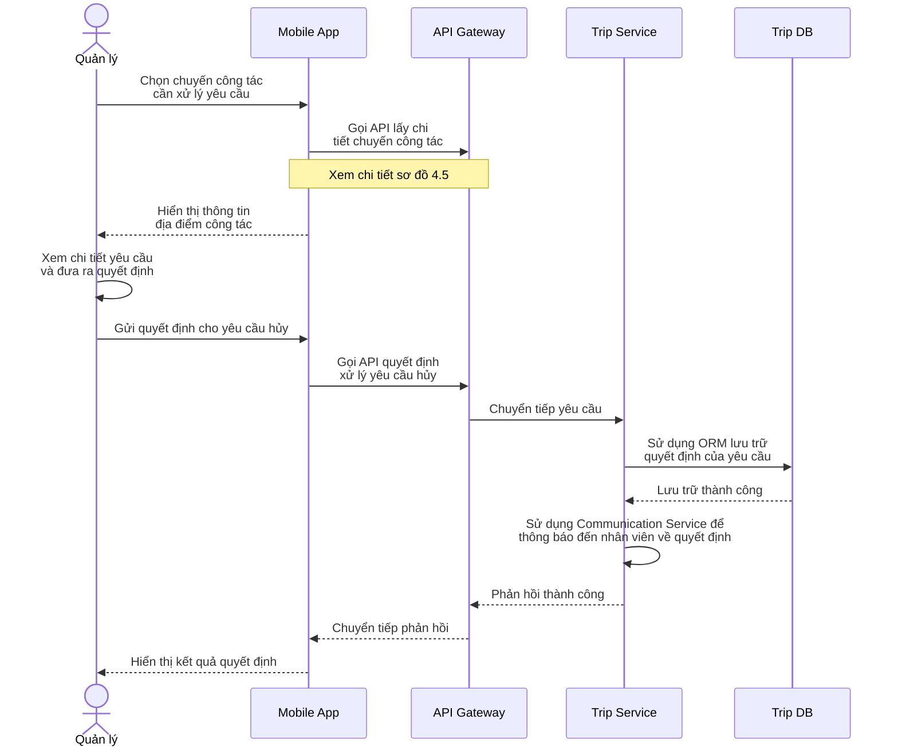
```mermaid
sequenceDiagram
    actor Emp as Quản lý
    participant App as Mobile App
    participant Gateway as API Gateway
    participant TripService as Trip Service
    participant DB as Trip DB

    Emp->>App: Chọn chuyến công tác<br/>cần xử lý yêu cầu
    App->>Gateway: Gọi API lấy chi<br/>tiết chuyến công tác
    Note over App, Gateway: Xem chi tiết sơ đồ 4.5
    App-->>Emp: Hiển thị thông tin <br/>địa điểm công tác
    Emp->>Emp: Xem chi tiết yêu cầu<br/>và đưa ra quyết định
    Emp->>App: Gửi quyết định cho yêu cầu hủy
    App->>Gateway: Gọi API quyết định<br/>xử lý yêu cầu hủy
    Gateway->>TripService: Chuyển tiếp yêu cầu
    TripService->>DB: Sử dụng ORM lưu trữ<br/>quyết định của yêu cầu
    DB-->>TripService: Lưu trữ thành công
    TripService->>TripService: Sử dụng Communication Service để<br/>thông báo đến nhân viên về quyết định
    TripService-->>Gateway: Phản hồi thành công
    Gateway-->>App: Chuyển tiếp phản hồi
    App-->>Emp: Hiển thị kết quả quyết định
```
