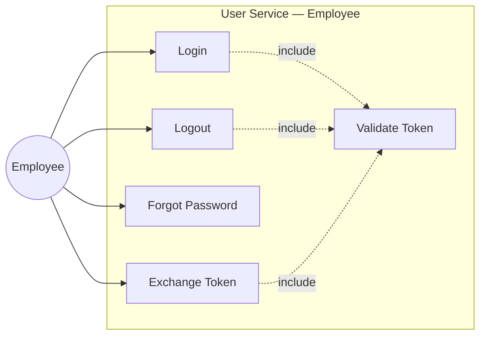
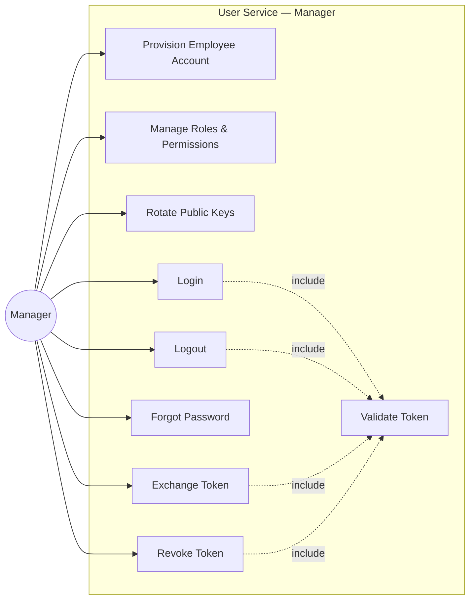
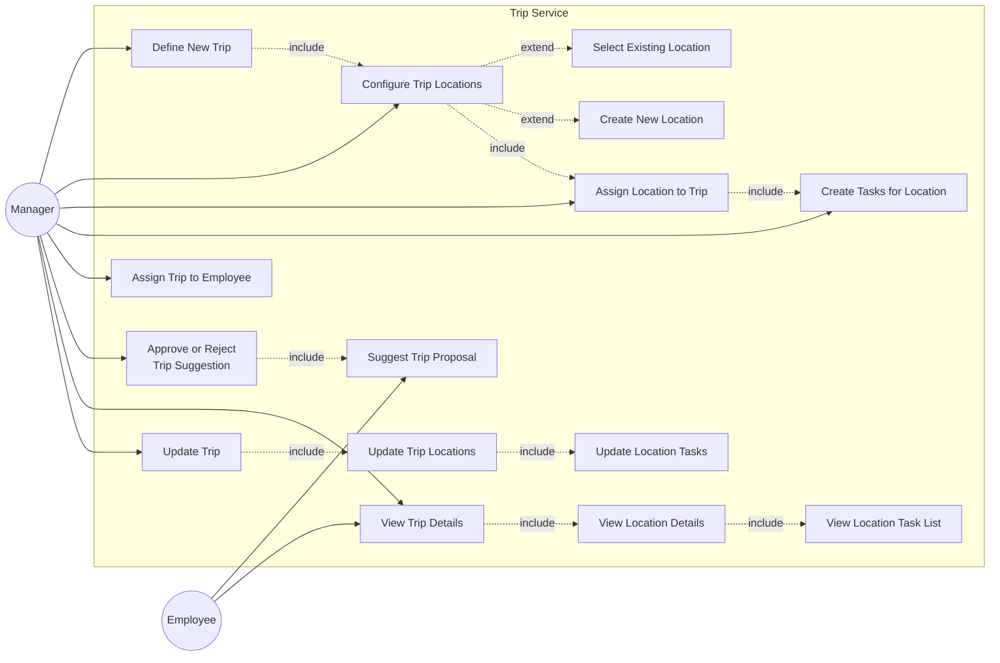
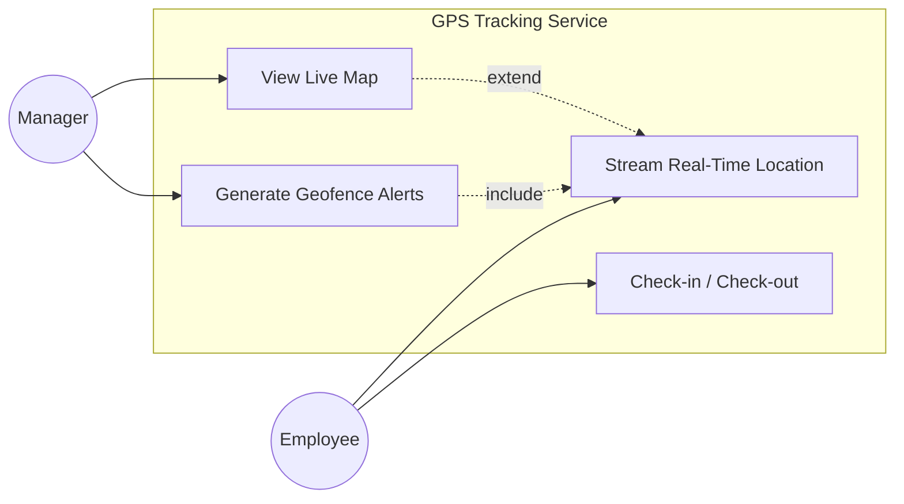
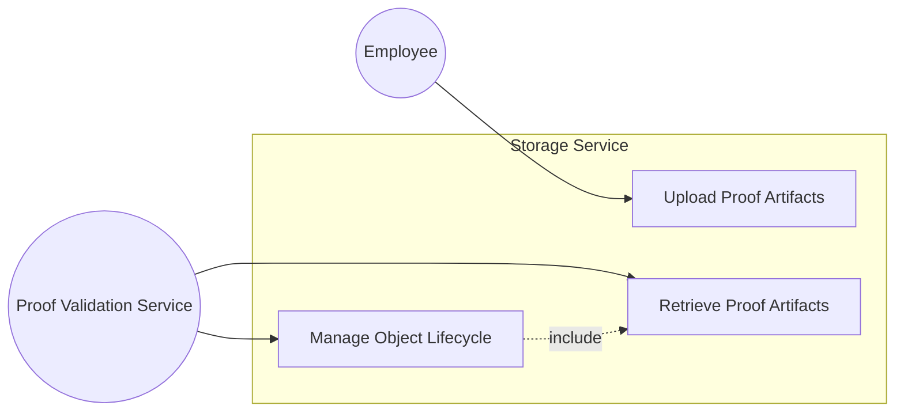
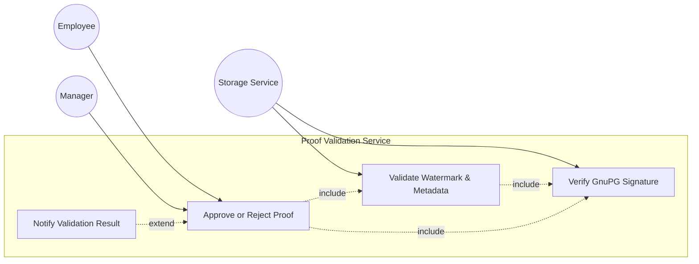
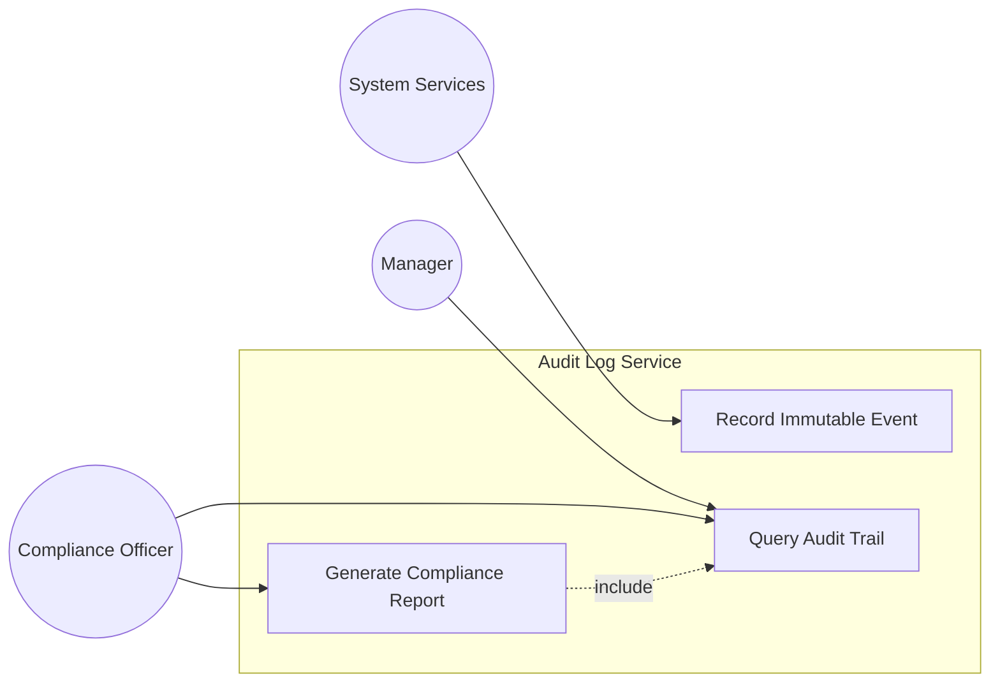
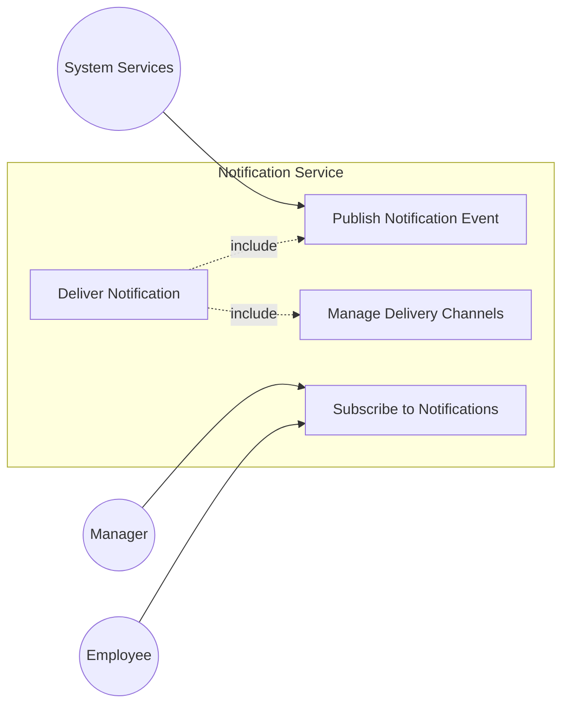

# Trip Sync System Use Cases

---

<!-- @import "[TOC]" {cmd="toc" depthFrom=2 depthTo=6 orderedList=false} -->

<!-- code_chunk_output -->

- [Trip Sync System Use Cases Table](#trip-sync-system-use-cases-table)
- [User Service Use Cases](#user-service-use-cases)
  - [Employee](#employee)
  - [Manager](#manager)
- [Trip Service Use Cases](#trip-service-use-cases)
- [GPS Tracking Service Use Cases](#gps-tracking-service-use-cases)
- [Storage Service Use Cases](#storage-service-use-cases)
- [Proof Validation Use Cases](#proof-validation-use-cases)
- [Audit Log Service Use Cases](#audit-log-service-use-cases)
- [Notification Service Use Cases](#notification-service-use-cases)

<!-- /code_chunk_output -->

---

## Trip Sync System Use Cases Table

---

## User Service Use Cases

The user service orchestrates identity lifecycle, session management, and authorization controls that underpin both the employee mobile experience and the manager web console. Separate diagrams and descriptions call out the responsibilities and dependencies for each persona.

### Employee

Employees day-to-day usage stays within the user service as well: employees authenticate, refresh access tokens, reset forgotten passwords, and securely terminate sessions. Every path funnels through `Validate Token`, so downstream services can trust that location updates, trip interactions, and proof submissions originate from authenticated sessions.

### Manager

Managers leverage the user service to administer the workforce as well as maintain their own authenticated access. Provisioning employees, assigning roles, and rotating public keys establish the security posture, while login, logout, password recovery, and token exchange oversee managerial sessions. The `Revoke Token` capability lets managers immediately invalidate compromised sessions, and the shared `Validate Token` pathway guarantees that privileged actions—like approving trips or reviewing proofs—are executed only by verified, authorized managers.

---

## Trip Service Use Cases

---

Trip creation starts with managers defining the trip scope and configuring its locations. During `Configure Trip Locations`, they either `Select Existing Location` records maintained by the service or `Create New Location` entries when operational sites are missing. Each selected location is formally attached through `Assign Location to Trip`, which immediately triggers `Create Tasks for Location` so managers can author the checklist that employees must fulfill on-site. Once the trip structure is ready, it can be assigned to an employee or left pending approval if the itinerary originated from an employee suggestion.

Both managers and employees can `View Trip Details`, which automatically expands into `View Location Details` and ultimately the `View Location Task List`. This ensures everyone sees the nested hierarchy of trip → locations → tasks without duplicative navigation. When changes arise, the `Update Trip` flow allows managers to adjust location assignments and task definitions via `Update Trip Locations` and `Update Location Tasks`, preserving the same structure. The service enforces immutability for deletions—trips, locations, and tasks cannot be removed once created—so updates focus on modifications rather than destructive operations.

## GPS Tracking Service Use Cases

---

## Storage Service Use Cases

---

## Proof Validation Use Cases

---

## Audit Log Service Use Cases

---

## Notification Service Use Cases

---

