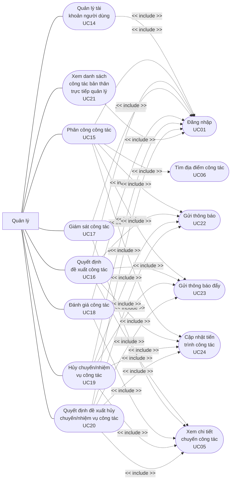

# Trip Sync System Use Case Diagram

---

<!-- @import "[TOC]" {cmd="toc" depthFrom=2 depthTo=6 orderedList=false} -->

<!-- code_chunk_output -->

- [Tổng quan các Use case](#tổng-quan-các-use-case)
  - [Use Case chung](#use-case-chung)
  - [Use Case với Nhân viên là tác nhân chính](#use-case-với-nhân-viên-là-tác-nhân-chính)
  - [Use Case với Quản lý là tác nhân chính](#use-case-với-quản-lý-là-tác-nhân-chính)
  - [Use Case với hệ thống là tác nhân chính](#use-case-với-hệ-thống-là-tác-nhân-chính)
- [Các sơ đồ Use Case](#các-sơ-đồ-use-case)
  - [Sơ đồ Use Case với Nhân viên là tác nhân chính](#sơ-đồ-use-case-với-nhân-viên-là-tác-nhân-chính)
  - [Sơ đồ Use Case với Quản lý là tác nhân chính](#sơ-đồ-use-case-với-quản-lý-là-tác-nhân-chính)

<!-- /code_chunk_output -->

---

## Tổng quan các Use case

### Use Case chung

Use case chung là những use case có tác nhân thực hiện là bao gồm Nhân viên và Quản lý. Khi nói đến "người dùng" ở đây bao gồm cả Nhân viên và Quản lý.

|  ID  | Name                         | Description                                                                                                                    |
| :--: | :--------------------------- | :----------------------------------------------------------------------------------------------------------------------------- |
| UC01 | Đăng nhập                    | Người dùng đăng nhập với hệ thống thông qua tài khoản được cấp                                                                 |
| UC02 | Đăng xuất                    | Người dùng đăng xuất ra khỏi hệ thống sau khi ở trạng thái đăng nhập                                                           |
| UC03 | Xem thông tin cá nhân        | Người dùng xem thông tin cá nhân trên hệ thống                                                                                 |
| UC04 | Cập nhật thông tin cá nhân   | Người dùng cập nhật thông tin cá nhân trên hệ thống                                                                            |
| UC05 | Xem chi tiết chuyến công tác | Người dùng xem chi tiết thông báo bao gồm thông tin chuyến công tác, địa điểm công tác, nhiệm vụ công tác, tiến trình công tác |
| UC06 | Tìm địa điểm công tác        | Người dùng tìm địa điểm công tác khi thực hiện tạo hoặc đề xuất chuyến công tác                                                |

**Danh sách các sự kiện có thông báo:**

| Mã sự kiện |                       Tên sự kiện                        | Người nhận (Nhân viên/Quản lý/Cả hai) | Use Case liên quan |
| :--------: | :------------------------------------------------------: | :-----------------------------------: | :----------------: |
|    SK01    |                     Đề xuất công tác                     |                Cả hai                 |        UC07        |
|    SK02    |               Quyết định đề xuất công tác                |               Nhân viên               |        UC16        |
|    SK03    |                    Phân công công tác                    |               Nhân viên               |        UC15        |
|    SK04    |                     Bắt đầu công tác                     |                Quản lý                |        UC10        |
|    SK05    |                    Kết thúc công tác                     |                Quản lý                |        UC11        |
|    SK06    |      Yêu cầu hủy chuyến công tác/nhiệm vụ công tác       |                Quản lý                |        UC13        |
|    SK07    | Quyết định yêu cầu hủy chuyến công tác/nhiệm vụ công tác |               Nhân viên               |        UC20        |

**Ghi chú:**

- Riêng nhân viên sẽ có thông báo đẩy trên ứng dụng di động và thông báo trên ứng dụng
- Tất cả sự kiện trên khi diễn ra đều sẽ ghi lại trong tiến trình thực hiện công tác (tiến trình công tác). UC26

### Use Case với Nhân viên là tác nhân chính

|  ID  | Tên                                              | Mô tả                                                                                                                                           |
| :--: | :----------------------------------------------- | :---------------------------------------------------------------------------------------------------------------------------------------------- |
| UC07 | Đề xuất chuyến công tác                          | Nhân viên đề xuất chuyến công tác mới với đầy đủ các thông tin cần thiét                                                                        |
| UC08 | Xem danh sách chuyến công tác bản thân thực hiện | Nhân viên xem được danh sách những chuyến công tác đã thực hiện và chưa thực hiện                                                               |
| UC09 | Gửi minh chứng                                   | Nhân viên thực hiện chụp hoặc tải ảnh lên ứng dụng, để ứng dụng ghi nhận vị trí GPS và thời gian gửi minh chứng và thực hiện lưu trữ minh chứng |
| UC10 | Bắt đầu công tác                                 | Nhân viên bắt đầu thực hiện chuyến công tác                                                                                                     |
| UC11 | Kết thúc công tác                                | Nhân viên kết thúc chuyến công tác                                                                                                              |
| UC12 | Check-in/Check-out tại địa điểm công tác         | Nhân viên thực hiện quá trình check-in/check-out tại địa điểm công tác                                                                          |
| UC13 | Gửi yêu cầu hủy chuyến/nhiệm vụ công tác         | Nhân viên thực hiện gửi yêu cầu hủy chuyến/nhiệm vụ công tác                                                                                    |

### Use Case với Quản lý là tác nhân chính

|  ID  | Tên                                               | Mô tả                                                                                                                                                                               |
| :--: | :------------------------------------------------ | :---------------------------------------------------------------------------------------------------------------------------------------------------------------------------------- |
| UC14 | Quản lý tài khoản người dùng                      | Quản lý tạo, xem, sửa đổi, kích hoạt hoặc khóa tài khoản cấp bậc nhân viên trên hệ thống                                                                                            |
| UC15 | Phân công công tác                                | Quản lý tạo chuyến công tác gồm các thông tin cơ bản của chuyến công tác, địa điểm công tác, nhiệm vụ công tác và lựa chọn nhân viên thực hiện chuyến công tác (phân công công tác) |
| UC16 | Quyết định đề xuất công tác                       | Quản lý đưa ra quyết định đề xuất công tác của nhân viên                                                                                                                            |
| UC17 | Giám sát công tác                                 | Quản lý giám sát quá trình thực hiện công tác của nhân viên                                                                                                                         |
| UC18 | Đánh giá công tác                                 | Quản lý thực hiện đánh giá chất lượng chuyến công tác sau khi chuyến công tác đã kết thúc                                                                                           |
| UC19 | Hủy chuyến/nhiệm vụ công tác                      | Quản lý thực hiện hủy chuyến/nhiệm vụ công tác khi cần thiết                                                                                                                        |
| UC20 | Quyết định yêu cầu hủy chuyến/nhiệm vụ công tác   | Quản lý đưa ra quyết định cho yêu cầu hủy chuyến công tác của nhân viên                                                                                                             |
| UC21 | Xem danh sách công tác bản thân trực tiếp quản lý | Quản lý xem danh sách các chuyến công tác của các nhân viên mà mình trực tiếp quản lý                                                                                               |

### Use Case với hệ thống là tác nhân chính

|  ID  | Tên                          | Mô tả                                                                                    |
| :--: | :--------------------------- | :--------------------------------------------------------------------------------------- |
| UC22 | Gửi thông báo                | Hệ thống gửi thông báo đến người nhận khi có sự kiện diễn ra                             |
| UC23 | Gửi thông báo đấy            | Hệ thống gửi thông báo đẩy đến nhân viên khi có sự kiện diễn ra                          |
| UC24 | Cập nhật tiến trình công tác | Hệ thống thực hiện lưu lại tiến trình diễn ra của chuyến công tác khi có sự kiện diễn ra |

**Ghi chú:** Người nhận ở đây bao gồm nhân viên và quản lý

---

## Các sơ đồ Use Case

### Sơ đồ Use Case với Nhân viên là tác nhân chính

### Sơ đồ Use Case với Quản lý là tác nhân chính

